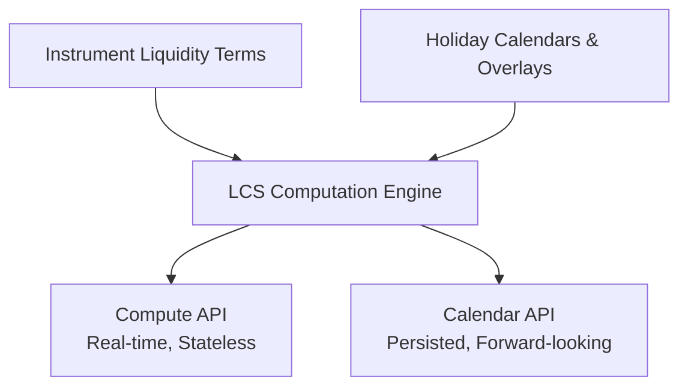

# Liquidity Calendar Service (LCS)

The **Liquidity Calendar Service** is a cross-cutting reference service in Osyte that computes and publishes instrument-level lifecycle dates (such as notification deadlines, trade placement, valuation strikes, and cash settlement).

By combining instrument-specific liquidity terms with market holiday calendars, LCS replaces manual, error-prone spreadsheet calculations with a single, real-time canonical source of truth.

---

## The Problem

Enterprise clients running multi-asset portfolios need to know precisely when to notify, trade, value, and settle for every instrument they hold. 
* **Today:** Ops analysts manually read liquidity terms from PPMs/side letters, open market holiday files (e.g., Copp Clark), count business days, and manually key them into spreadsheets and Order Management Systems (OMS).
* **The Consequences:** This process is highly inefficient, prone to manual errors (which can lead to missed dealing windows and delayed redemptions), and creates inconsistent dates across Investment Planning, Rebalancing, and Trade Ops systems.

## The Solution

LCS provides a shared, deterministic computation engine exposed via two main API surfaces:

1. **Compute API (Real-Time & Stateless):** Given an instrument and an anchor date, it instantly returns the derived lifecycle dates. Ideal for inline use by Investment Planning, Rebalancing, and Trade Ops workflows.
2. **Calendar API (Persisted & Materialized):** Publishes a full, forward-dated calendar per instrument for downstream systems to consume, subscribe to, or export.

---

## Key Features

* **Pluggable & Composite Holiday Data:** Copp Clark is the default holiday source. Clients can supply their own exception lists or custom calendars. LCS merges these, overlaying client-specific exceptions on top of the base vendor data.
* **Automated Recomputation & Changelogs:** When holiday data updates are published (e.g., mid-year updates from Copp Clark), affected instrument calendars are recomputed automatically. A published changelog details which dates moved and which instruments are affected.
* **Standard Roll Conventions:** Full support for standard roll conventions (e.g., *Following*, *Modified Following*, *Preceding*, *Modified Preceding*) and multi-calendar currency alignments.
* **Historical Auditability:** Calendars are effective-versioned, allowing users to query "what did the calendar say on date X" for compliance and audit reconciliation.
* **Assistive AI & MCP Server:**
  * **Natural Language Queries:** Users can ask questions like *"when's the next redemption notification deadline across the alternatives book?"* in plain English.
  * **MCP (Model Context Protocol) Server:** Exposes the query layer as an MCP service so external AI assistants can natively query key dates.
  * *Note: AI is strictly for natural-language querying and metadata extraction; date computation is 100% deterministic.*

---

## Client Value

| Team | Value Proposition |
| :--- | :--- |
| **Investment Teams** | See accurate next-trade, next-valuation, and next-notification dates directly in Investment Planning and Rebalancing. |
| **Operations** | Stop maintaining manual per-fund Excel calendars. Holiday updates automatically propagate with clean audit trails. |
| **Compliance & Risk** | Eliminate date-mismatch breaks. Ensure all systems (Investment Planning, Rebalancing, Trade Ops) query the same canonical service. |
| **Client-Service & Reporting** | Instantly export and share reliable forward calendars with LPs without waiting for manual verification. |