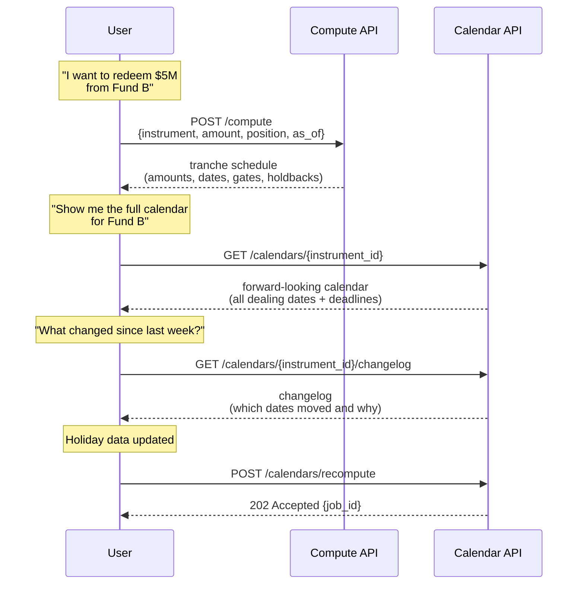
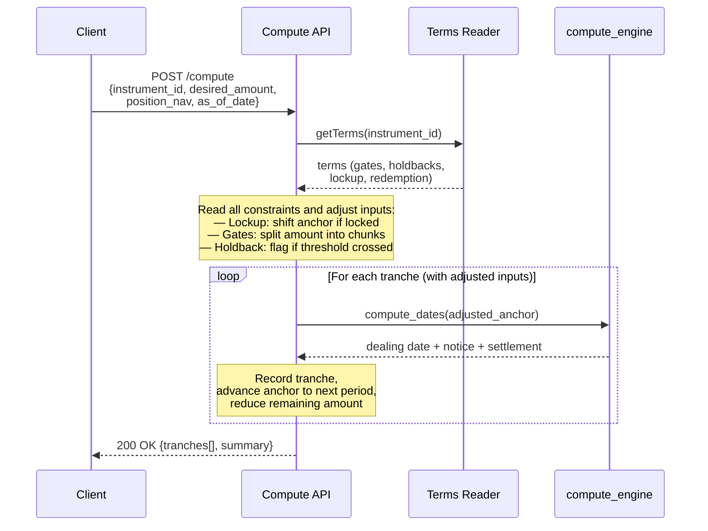
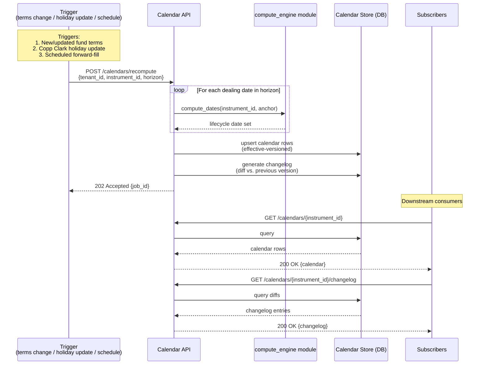
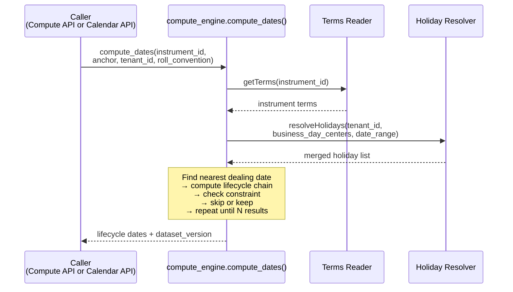
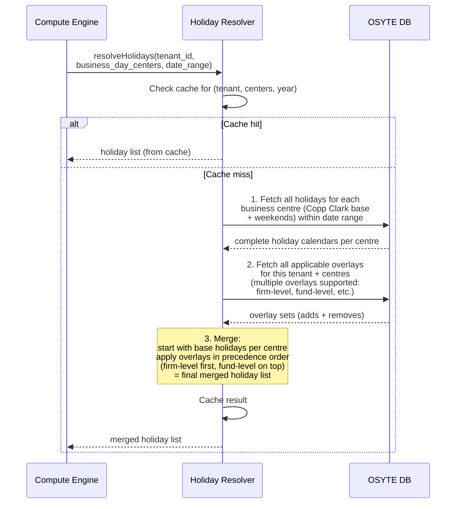

# LCS Architecture

## Running Examples

Two funds are used throughout this document to explain every component:

**Fund A — Simple (any listed asset like a stock or ETF):** Daily dealing. No lockup, no gates, no holdback. No notice period. T+1 settlement. Business day centres: `["London"]`.

**Fund B — Complex:** Quarterly dealing (1st business day of each quarter). 12-month hard lockup from subscription. 25% investor gate per quarter. 5% audit holdback on redemptions ≥95% of account. 30-day notice, 30-day settlement. Business day centres: `["New York", "Cayman Islands"]`.

---

## 1. System Overview

LCS reads fund liquidity terms and holiday calendars from OSYTE's existing platform, computes lifecycle dates, and simulates redemption schedules. It does not store source data — it reads from OSYTE and only persists materialized calendars.

Two APIs, one shared module:

| API | Purpose |
|---|---|
| **Compute API** | Liquidation planning — reads constraints (lockups, gates, holdbacks), adjusts inputs, then calls the compute engine per tranche to get dates. |
| **Calendar API** | Persisted forward-looking calendars. Calls the compute engine to recompute, then serves from Calendar Store. |

Both APIs import the same **compute engine** module — a shared library containing the date engine, Holiday Resolver, and Terms Reader. No HTTP calls between them, no code duplication. Change the engine once, both APIs get the update.



### Codebase structure

```
lcs/
  compute_engine/           ← shared module, imported by both APIs
    engine.py               ← find-check-skip algorithm
    holidays.py             ← Holiday Resolver (fetch, merge, cache)
    terms.py                ← Terms Reader (fetch from OSYTE)
    compute.py              ← wires HR + TR + engine together

  compute_api/              ← imports compute_engine/
    routes.py               ← reads constraints, calls compute_engine per tranche

  calendar_api/             ← imports compute_engine/
    calendar_routes.py      ← /calendars endpoints
    recompute.py            ← loops over dealing dates, calls compute_engine
    store.py                ← Calendar Store (read/write)
```

---

## 2. Compute API

Handles liquidation planning. Reads the instrument's constraints (lockups, gates, holdbacks), adjusts inputs accordingly, then calls `compute_engine.compute_dates()` per tranche to get dates.

**What it does:**
1. **Read constraints** from the instrument terms
2. **Adjust inputs** before any date computation:
   - Hard lockup active? → shift anchor to lockup expiry
   - Soft lockup? → flag early-exit fee, proceed
   - Amount exceeds gate? → split into max-per-period chunks
   - Holdback threshold crossed? → flag holdback on relevant tranche
3. **Call compute engine per tranche** with adjusted anchor
4. **Return schedule** — tranches with amounts, dates, and any fees/holdbacks

### Workflow



### Example — Fund A: Redeem $1M, as of 2026-07-01

```
Read constraints:
  Lockup?    No   → no adjustment
  Gates?     None → no split
  Holdback?  No   → skip

Nothing to adjust — call compute_engine directly.

compute_dates(anchor=2026-07-01)
  → Dealing: Jul 1 | Notice: n/a | Settlement: Jul 2

Result: 1 tranche
┌─────────┬────────────┬────────┬─────────┬────────┐
│ Tranche │ Amount     │ Notice │ Dealing │ Cash   │
├─────────┼────────────┼────────┼─────────┼────────┤
│ 1       │ $1,000,000 │ n/a    │ Jul 01  │ Jul 02 │
└─────────┴────────────┴────────┴─────────┴────────┘
```

### Example — Fund B: Redeem $5M from $8M position, subscribed 2025-01-15, as of 2026-07-01

```
Read constraints:
  Lockup?    Hard, 12 months from 2025-01-15 → expires 2026-01-15
             as_of (Jul 1) > expiry (Jan 15) → unlocked. Proceed.
             (If as_of were 2025-06-01, anchor would shift to 2026-01-15.)
  Gates?     25% of holding per quarter → $2M max/quarter
             $5M ÷ $2M = 3 tranches needed
  Holdback?  5% if ≥ 95% of account
             $5M / $8M = 62.5% → NOT triggered

compute_engine calls (one per tranche):
  T1: compute_dates(anchor=2026-07-01)
      → Dealing: Oct 1 | Notice: Sep 1 | Settlement: Oct 31
  T2: compute_dates(anchor=2026-10-02)
      → Dealing: Jan 2 | Notice: Dec 3 | Settlement: Feb 1
  T3: compute_dates(anchor=2027-01-03)
      → Dealing: Apr 1 | Notice: Mar 2 | Settlement: May 1

Result: 3 tranches
┌─────────┬────────────┬────────┬─────────┬────────┬───────────┐
│ Tranche │ Amount     │ Notice │ Dealing │ Cash   │ Gate-ltd? │
├─────────┼────────────┼────────┼─────────┼────────┼───────────┤
│ 1       │ $2,000,000 │ Sep 01 │ Oct 01  │ Oct 31 │ Yes       │
│ 2       │ $2,000,000 │ Dec 03 │ Jan 02  │ Feb 01 │ Yes       │
│ 3       │ $1,000,000 │ Mar 02 │ Apr 01  │ May 01 │ No        │
└─────────┴────────────┴────────┴─────────┴────────┴───────────┘

Total: $5M | First cash: Oct 31 | Last cash: May 1 | Holdback: $0 | Exit fee: $0
```

---

## 3. Calendar API

Separate API from Compute. Uses the same compute engine module to recompute forward-looking calendars, then serves them from the Calendar Store.

**What it does:**
1. On trigger (terms change, holiday update, scheduled refresh), recomputes the calendar for affected instruments
2. For each dealing date in the horizon, calls `compute_engine.compute_dates()` directly (in-process, no HTTP)
3. Writes results to the Calendar Store (effective-versioned — old versions never deleted)
4. Diffs against the previous version → changelog showing which dates moved and why
5. Serves calendars and changelogs to downstream consumers

### Workflow



Recomputation is **async** — returns `202 Accepted` with a `job_id`. Poll `GET /jobs/{job_id}` for status. Jobs are idempotent on `(tenant_id, instrument_id, reason)`.

### Recomputation Triggers

| Trigger | Scope | Behaviour |
|---|---|---|
| Fund terms updated | Single instrument | Recompute that instrument's calendar; changelog shows which dates moved |
| Copp Clark holiday file update | All instruments using affected centres | Identify affected instruments via `business_day_centers`; batch recompute; changelog per instrument |
| Client overlay change | Instruments using that overlay | Same as holiday update but scoped to client's instruments |
| Scheduled forward-fill | All instruments | Extend horizon as time passes (e.g. weekly cron to maintain 24-month forward window) |

### Example — Monthly dealing fund (Complus Asia Macro Fund)

Complus deals monthly on the 1st business day. 30-day calendar notice, 20-day settlement. Business day centres: `["Hong Kong"]`.

**Recomputed calendar (2026 Q4 → 2027 Q1):**

```
Dealing date     | Notice deadline | Settlement date
─────────────────┼─────────────────┼────────────────
2026-10-01       | 2026-09-01      | 2026-10-21
2026-11-02       | 2026-10-03      | 2026-11-22
2026-12-01       | 2026-11-01      | 2026-12-21
2027-01-02       | 2026-12-03      | 2027-01-22
2027-02-03       | 2027-01-04      | 2027-02-23
2027-03-01       | 2027-01-29      | 2027-03-21
```

**Changelog after Copp Clark mid-year update** (adds Oct 2 as a Hong Kong holiday):

```
Change: Nov dealing date moved from 2026-11-01 → 2026-11-02
        (Nov 1 was already adjusted; Oct 2 holiday shifts the business day
         count for October notice deadline from Oct 02 → Oct 03)
Reason: Hong Kong holiday added on 2026-10-02 by Copp Clark update
Affected fields: dealing_date, notice_deadline
```

### Example — Quarterly dealing fund with multiple dealing days

A fund deals on both the 1st and 15th of each quarter-end month. 45-day notice, 30-day settlement. Business day centres: `["London"]`.

**Recomputed calendar (2027 H1):**

```
Dealing date     | Label          | Notice deadline | Settlement date
─────────────────┼────────────────┼─────────────────┼────────────────
2027-01-02       | 1st biz day    | 2026-11-18      | 2027-02-01
2027-01-15       | 15th           | 2026-12-01      | 2027-02-14
2027-04-01       | 1st biz day    | 2027-02-15      | 2027-05-01
2027-04-15       | 15th           | 2027-03-01      | 2027-05-15
```

Each dealing day generates its own independent lifecycle chain. Both are stored in the same calendar, sorted chronologically.

### Calendar Store

The one thing LCS owns. Effective-versioned: every recomputation creates a new version, enabling "what did the calendar say on date X?" queries for audit.

```sql
CREATE TABLE calendar_versions (
    version_id          BIGSERIAL PRIMARY KEY,
    tenant_id           VARCHAR(50) NOT NULL,
    instrument_id       VARCHAR(50) NOT NULL,
    effective_from      TIMESTAMPTZ NOT NULL,
    superseded_at       TIMESTAMPTZ,
    trigger_reason      VARCHAR(30) NOT NULL,
    dataset_version     JSONB NOT NULL,
    horizon_from        DATE NOT NULL,
    horizon_to          DATE NOT NULL,
    created_at          TIMESTAMPTZ NOT NULL,
    UNIQUE (tenant_id, instrument_id, effective_from)
);

CREATE TABLE calendar_dates (
    id                  BIGSERIAL PRIMARY KEY,
    version_id          BIGINT NOT NULL REFERENCES calendar_versions(version_id),
    scope               VARCHAR(12) NOT NULL,
    dealing_day_label   VARCHAR(50),
    dealing_date        DATE NOT NULL,
    notice_deadline     DATE,
    settlement_date     DATE,
    document_deadline   DATE,
    cash_funding_deadline DATE,
    nav_pricing_cutoff  DATE,
    cutoff_time         TIME,
    cutoff_timezone     VARCHAR(50),
    roll_applied        VARCHAR(20),
    unadjusted_date     DATE,
    UNIQUE (version_id, scope, dealing_date, dealing_day_label)
);

CREATE TABLE calendar_changelog (
    id                  BIGSERIAL PRIMARY KEY,
    version_id          BIGINT NOT NULL REFERENCES calendar_versions(version_id),
    previous_version_id BIGINT REFERENCES calendar_versions(version_id),
    scope               VARCHAR(12) NOT NULL,
    dealing_date        DATE NOT NULL,
    field_name          VARCHAR(30) NOT NULL,
    previous_value      DATE,
    new_value           DATE,
    reason              TEXT
);
```

---

## 4. Compute Engine (shared module)

Used by both APIs. Takes terms + holidays + anchor + roll convention → produces lifecycle dates. Pure function — same inputs always produce same outputs.

**Algorithm:**

1. **Find the nearest dealing date** from the anchor
2. **Compute the full lifecycle chain** for that date (notice deadline, settlement, etc.)
3. **Check if it satisfies the anchor constraint** — yes → keep; no → skip to next dealing date
4. **Repeat** until N results collected

| `anchor_type` | "Nearest" means | Check |
|---|---|---|
| `as_of` | Next dealing date ≥ anchor | Always passes |
| `target_settlement_date` | Nearest dealing date before anchor | `settlement_date ≤ target`? |
| `target_dealing_date` | Nearest valid dealing date to given date | Snap if not valid, warn |
| `target_notice_deadline` | Next dealing date after anchor | `notice_deadline ≥ anchor`? |

**Multiple dealing days:** A fund can have multiple dealing days per period (e.g. 1st and 15th, stored as `%+%` in OSYTE). The engine iterates all per period, returns results chronologically sorted.

**Business day adjustment:** If a date lands on a holiday/weekend, the roll convention adjusts it (Following, Modified Following, Preceding, Modified Preceding). Default: Modified Following. When multiple centres apply, a date must be a business day in all of them.

> **Known schema gap:** v15.5 has no `roll_convention` field. Currently an API parameter.

**Centre precedence:** Rule-level `business_day_centers` (e.g. on notice_period) override instrument-level for that calculation.

**Completeness gate:** Before computing, the engine checks `availability` on every field. `unknown` / `not_assessed` → null + warning. When `value_type` is `minimum` / `estimated` / `discretionary`, the result is flagged as approximate.

Every result includes `dataset_version: {holiday_file_id, terms_version, overlay_hash}` for reproducibility.

### Workflow



### Example — Fund A: `compute_dates(anchor=2026-07-01, anchor_type=as_of)`

```
Terms Reader → daily dealing, no notice, T+1 settlement, centres: [London]
Holiday Resolver → merged holiday list for London 2026

Find nearest dealing date ≥ Jul 1 → Jul 1 (business day in London)
  Notice: n/a
  Settlement: Jul 1 + 1 business day = Jul 2

Result: Dealing: 2026-07-01 | Notice: n/a | Cash: 2026-07-02
```

### Example — Fund B: `compute_dates(anchor=2026-10-31, anchor_type=target_settlement_date)`

```
Terms Reader → quarterly dealing (1st biz day), 30-day notice, 30-day settlement, centres: [New York, Cayman Islands]
Holiday Resolver → merged holiday list for NY + Cayman 2026

Find nearest dealing date before Oct 31:
  Q4 dealing date = Oct 1 (1st business day of Q4)
  Notice: Oct 1 − 30 calendar days = Sep 1
  Settlement: Oct 1 + 30 calendar days = Oct 31
  Check: settlement (Oct 31) ≤ target (Oct 31)? → Yes ✓

Result: Dealing: 2026-10-01 | Notice by: 2026-09-01 | Cash: 2026-10-31

(If target were Oct 15, settlement would be Oct 31 > Oct 15 → fail.
 Engine would try the previous quarter: Jul 1 → settlement Jul 31 ≤ Oct 15 → pass.)
```

---

## 5. Holiday Resolver

Reads holiday data from OSYTE's DB and returns a single merged holiday list per request. LCS does not store or manage holiday data.

**Steps:**
1. Fetch all holidays for the fund's business centres (Copp Clark base + weekends)
2. Fetch all applicable tenant overlays (multiple supported — firm-level, fund-level, etc.)
3. Merge: base → overlays in precedence order → final merged holiday list

**Caching:** Base calendars for popular centres (US, GB) are cached long-lived. Resolved sets (base + tenant overlays) are cached with short TTL. Cache is invalidated when OSYTE signals a data update.

**Centre aliases:** Fund terms say "Cayman Islands"; Copp Clark says "George Town". The Holiday Resolver resolves this transparently via OSYTE's alias table.

### Workflow



### Example — Fund A (London)

```
Fetch holidays for London (2026)
Fetch tenant overlays → none
Merge → [Jan 1, Apr 10, Apr 13, May 8, May 25, Aug 31, Dec 25, Dec 26, ...]
```

### Example — Fund B (New York, Cayman Islands)

```
Resolve alias: "Cayman Islands" → "George Town" (center_id 42)
Fetch holidays for New York + George Town (2026)
Fetch tenant overlays → firm-level: adds Nov 27 (day after Thanksgiving) to New York
Merge → [Jan 1, Jan 19, Jan 26, Feb 16, May 18, May 25, Jul 3, Jul 6, Sep 7, Nov 9, Nov 26, Nov 27, Dec 25, ...]
         (union of both centres + overlay add)
```

---

## 6. Terms Reader

Reads fund liquidity terms from OSYTE on demand. No local storage. Fetches by `instrument_id` or `fund_id`.

### Example — Fund A

```json
{
  "dealing_basis": "periodic",
  "dealing_interval": {"count": 1, "unit": "day"},
  "notice_period": {"days": 0, "availability": "not_applicable"},
  "settlement": {"days": 1, "day_type": "business", "direction": "after"},
  "gates": [],
  "restrictions": {"lockup_provisions": {"no_lockup": true}, "audit_holdbacks": {"holdback_applies": false}}
}
```

### Example — Fund B

```json
{
  "dealing_basis": "periodic",
  "dealing_interval": {"count": 3, "unit": "month"},
  "dealing_day": {"anchor": "first", "day_type": "business"},
  "notice_period": {"days": 30, "day_type": "calendar", "direction": "before"},
  "settlement": {"days": 30, "day_type": "calendar", "direction": "after"},
  "gates": [{"gate_level": "investor_level", "threshold_pct": 25, "measurement_period": "quarterly"}],
  "restrictions": {
    "lockup_provisions": {"hard_lockup": {"duration": {"count": 12, "unit": "month"}, "start_basis": "subscription_day"}},
    "audit_holdbacks": {"holdback_applies": true, "holdback_tiers": [{"condition": "redemption_gte_pct_nav", "threshold_pct": 95, "holdback_pct": 5}]}
  }
}
```

---

## 7. Key Decisions

| # | Decision | Why |
|---|---|---|
| 1 | **LCS reads from OSYTE, owns nothing except Calendar Store** | Single source of truth. No data duplication. |
| 2 | **`compute_engine` is a shared module** | Engine, Holiday Resolver, and Terms Reader are a library imported by both APIs. Change the engine once, both APIs get the update. No HTTP between them, no code duplication. |
| 3 | **Compute API and Calendar API are separate APIs** | Compute API handles planning (constraints + tranches). Calendar API handles recomputation (forward calendars + changelogs). Both call `compute_engine` directly. |
| 4 | **Compute API reads constraints first, then calls the engine** | Constraints change the inputs (anchor shift for lockup, amount split for gates). The engine never needs to know about constraints — it just computes dates. |
| 5 | **Holiday Resolver returns a single merged holiday list** | Base holidays + all overlays merged into one list. The engine gets one resolved list. No complex interface needed. |
| 6 | **Holiday Resolver caches popular centres** | US/GB base calendars cached long-lived. Resolved sets cached short-lived. Only cold centres hit the DB. |
| 7 | **Calendar Store is effective-versioned** | Supports "what did the calendar say on date X?" for audit. Old versions never deleted. |
| 8 | **Dataset version stamp on every response** | `{holiday_file_id, terms_version, overlay_hash}` enables reproducibility and audit. |
| 9 | **Find-check-skip algorithm** | All anchor modes use the same loop. Offsets + rolls are non-invertible, so we always compute forward and verify. |

---

## 8. Security

| Concern | Approach |
|---|---|
| **Authentication** | Bearer token validated against OSYTE's auth service |
| **Tenant isolation** | `tenant_id` verified against token claims. Tenant A cannot access tenant B's overlays or calendars |
| **Holiday isolation** | Base Copp Clark is shared (read-only). Overlays scoped by tenant. |
| **Calendar isolation** | Keyed by `(tenant_id, instrument_id)` |
| **Planning data** | Position data (NAV, amounts) is never persisted — accepted, used, discarded |
