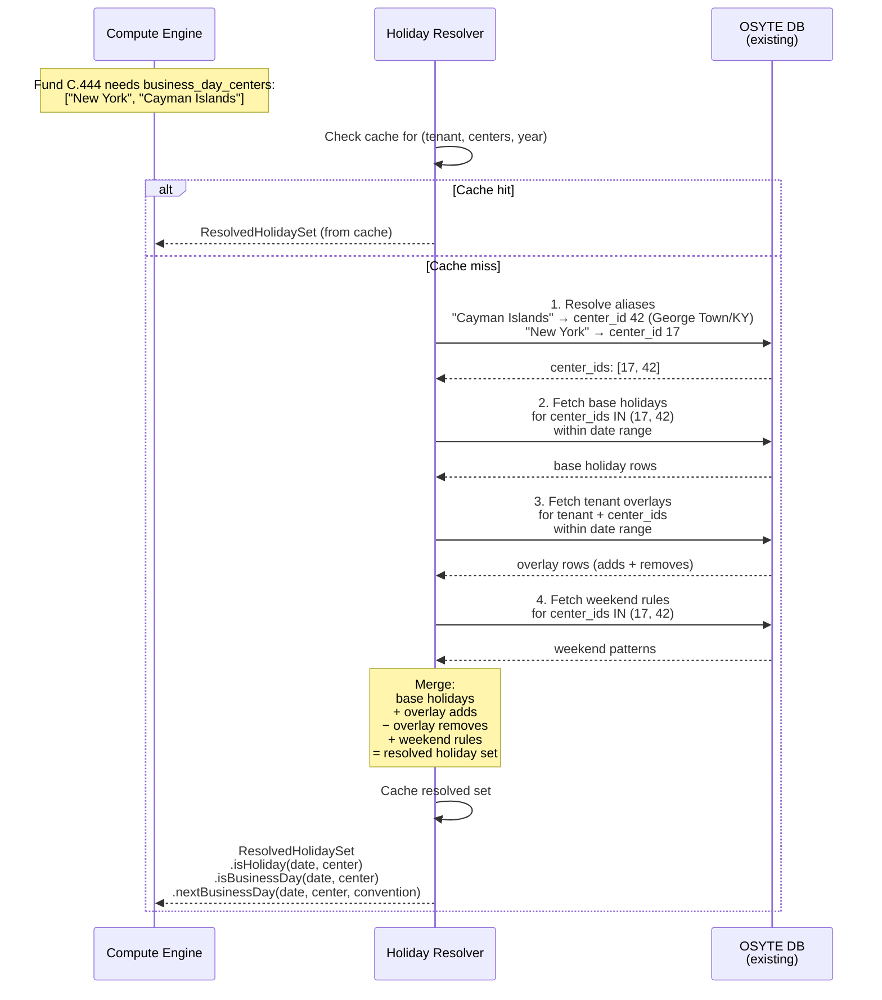
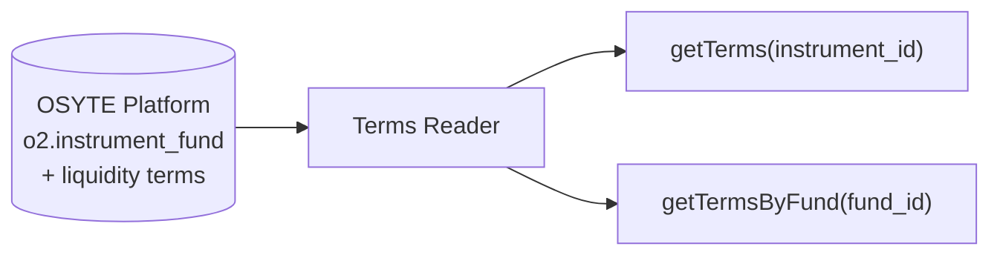
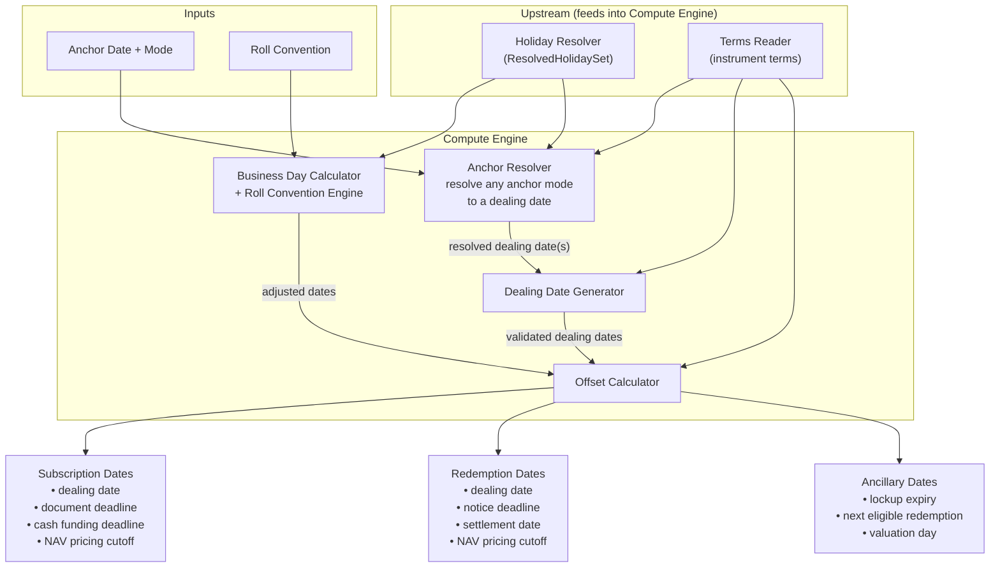
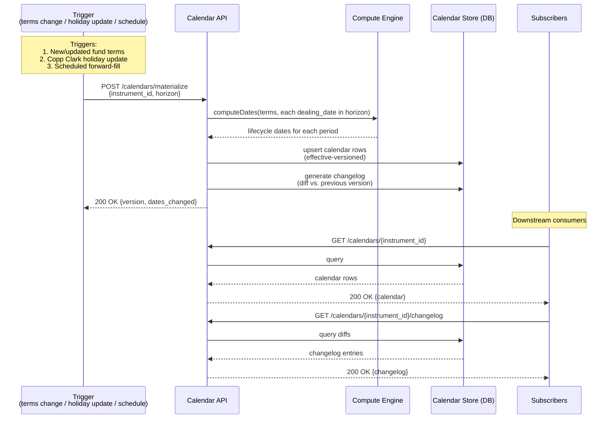
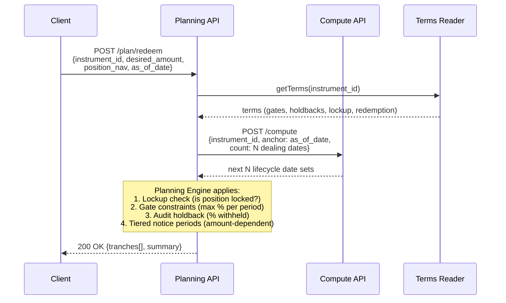
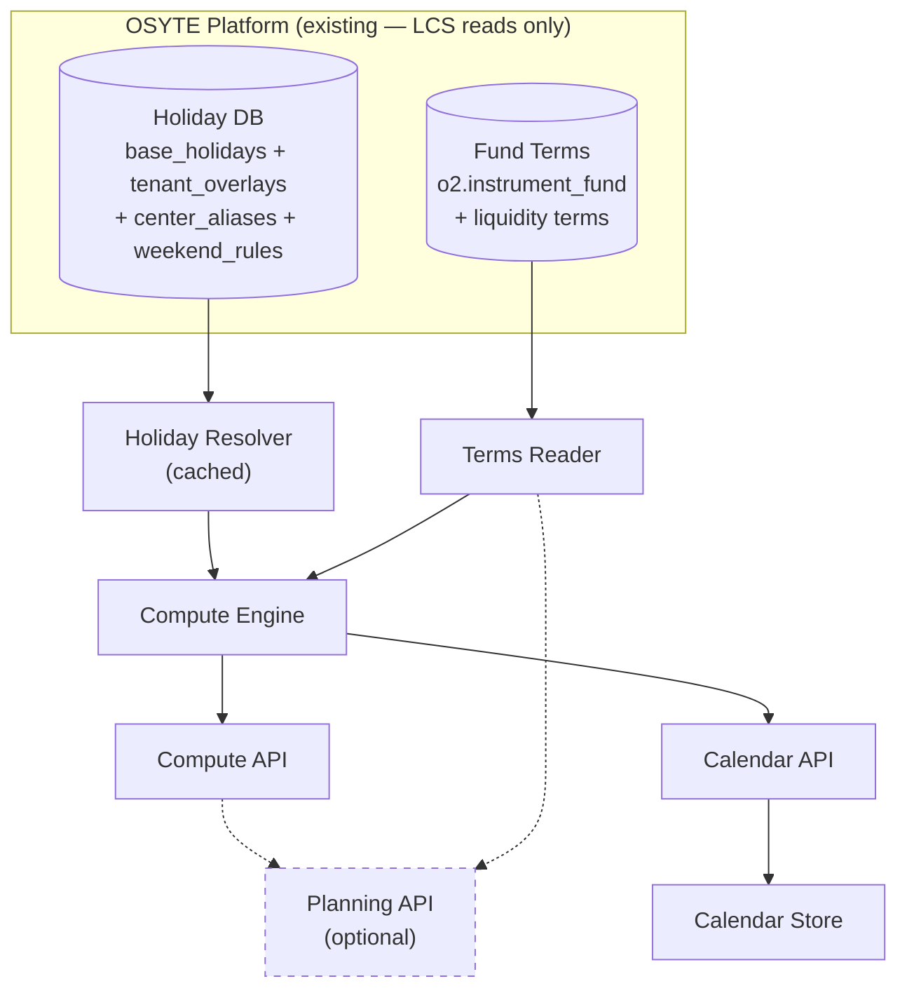

# LCS Architecture & Workflow Design

## 1. System Overview

LCS is a **deterministic date-computation service** that reads fund liquidity terms and market holiday calendars from OSYTE's existing platform and computes canonical lifecycle dates for every instrument. LCS does not own or store the source data — it reads from OSYTE and only persists its own computed output (materialized calendars).

The system is split into a **core layer** (date computation — not debated) and an **optional planning layer** (liquidation simulation through gates/holdbacks — under discussion). The architecture treats these as cleanly separable: the planning layer consumes the core layer's output but never contaminates it.

```
  ┌──────────────────────────────────────────────────────────────┐
  │               OSYTE Platform (existing)                       │
  │                                                               │
  │   ┌──────────────────┐        ┌──────────────────┐           │
  │   │ Holiday Data     │        │ Fund Liquidity    │           │
  │   │                  │        │ Terms             │           │
  │   │ Copp Clark       │        │                   │           │
  │   │ + tenant overlays│        │ v15.5 records     │           │
  │   │ + center aliases │        │ (26 instruments)  │           │
  │   │ + weekend rules  │        │                   │           │
  │   └────────┬─────────┘        └─────────┬─────────┘           │
  └────────────┼────────────────────────────┼─────────────────────┘
               │ read                       │ read
  ┌────────────┼────────────────────────────┼─────────────────────┐
  │            │          LCS Service       │                      │
  │  ┌─────────────────────────────────────────────────────────┐  │
  │  │                   CORE (deterministic)                   │  │
  │  │                                                          │  │
  │  │  ┌──────────────┐          ┌──────────────┐             │  │
  │  │  │Holiday Reader│          │ Terms Reader │             │  │
  │  │  │ (fetches &   │          │ (fetches by  │             │  │
  │  │  │  resolves per│          │  instrument) │             │  │
  │  │  │  tenant)     │          │              │             │  │
  │  │  └──────┬───────┘          └──────┬───────┘             │  │
  │  │         │                         │                      │  │
  │  │         └────────────┬────────────┘                      │  │
  │  │                      ▼                                   │  │
  │  │            ┌─────────────────┐                           │  │
  │  │            │   Compute Engine   │                           │  │
  │  │            │                 │                           │  │
  │  │            │ Anchor resolver │                           │  │
  │  │            │ Roll conventions│                           │  │
  │  │            │ Biz-day math   │                           │  │
  │  │            │ Dealing-date   │                           │  │
  │  │            │ generation     │                           │  │
  │  │            └────────┬───────┘                           │  │
  │  │                     │                                    │  │
  │  │          ┌──────────┴──────────┐                        │  │
  │  │          │                     │                        │  │
  │  │   ┌──────▼──────┐      ┌──────▼───────┐                │  │
  │  │   │ Compute API │      │ Calendar API │                │  │
  │  │   │ (stateless) │      │ (persisted)  │                │  │
  │  │   └─────────────┘      └──────────────┘                │  │
  │  └─────────────────────────────────────────────────────────┘  │
  │                                                                │
  │  ┌ ─ ─ ─ ─ ─ ─ ─ ─ ─ ─ ─ ─ ─ ─ ─ ─ ─ ─ ─ ─ ─ ─ ─ ─ ─ ─ ┐ │
  │    OPTIONAL — Liquidation Planning (under discussion)        │ │
  │  │                                                          │ │
  │     ┌──────────────────────────────────────────────────┐    │ │
  │  │  │ Planning Engine                                  │    │ │
  │     │ Consumes: Compute API output + position data     │    │ │
  │  │  │ Applies:  gates, holdbacks, lockup constraints   │    │ │
  │     │ Returns:  tranche schedule (amount × date)       │    │ │
  │  │  └──────────────────────────────────────────────────┘    │ │
  │                                                              │ │
  │  │  ┌──────────────────┐                                    │ │
  │     │ Planning API     │                                    │ │
  │  │  └──────────────────┘                                    │ │
  │  └ ─ ─ ─ ─ ─ ─ ─ ─ ─ ─ ─ ─ ─ ─ ─ ─ ─ ─ ─ ─ ─ ─ ─ ─ ─ ─ ┘ │
  └────────────────────────────────────────────────────────────────┘
```

---

## 2. Component Architecture

### 2.1 Holiday Resolver

Reads holiday data from OSYTE's existing DB (Copp Clark base holidays, tenant overlays, centre aliases, weekend rules) and merges it into a resolved holiday set for each computation request. LCS does not ingest, store, or manage any holiday data — that's all handled by the OSYTE platform.

#### Holiday Resolution

When the Compute or Calendar API processes a request, the Holiday Resolver fetches the relevant data from OSYTE's DB and resolves it for the specific tenant + fund combination:



The returned `ResolvedHolidaySet` is an in-memory object that the Compute Engine uses for all business-day calculations during that computation. This means:
- Different tenants get different holiday sets (same Copp Clark base, different overlays)
- Only the centres relevant to the fund are fetched, not the entire 400K-row dataset

#### Caching

A small number of centres dominate traffic — US (New York) and GB (London) appear in the vast majority of fund terms. Hitting the DB for these on every request is wasteful.

The Holiday Resolver maintains a **two-tier cache**:

| Tier | What's cached | Key | TTL | Invalidation |
|---|---|---|---|---|
| **Base calendar cache** | Copp Clark holidays for a centre + date range | `(center_id, year)` | Long-lived (until OSYTE signals a Copp Clark update) | Evict entries for affected centres when notified of a data update |
| **Resolved set cache** | Fully merged holiday set (base + tenant overlay) for a tenant + centre + date range | `(tenant_id, center_id, year)` | Short-lived (minutes) or event-driven | Evict when notified of an overlay change for that tenant + centre |

**How it works:**
1. Request comes in for tenant `acme`, centres `["New York", "London"]`, date range 2026
2. Check resolved set cache for `(acme, new_york, 2026)` and `(acme, london, 2026)` — **cache hit** on most requests since these are the popular centres
3. On cache miss: check base calendar cache for `(new_york, 2026)` — almost always warm since US/GB base calendars are requested constantly
4. Fetch tenant overlays from OSYTE DB (these are small — typically 0–5 rows per tenant per centre)
5. Merge, cache the resolved set, return

Weekend rules and centre aliases are cached indefinitely (they change approximately never).

Since most tenants have few or zero overlays for the popular centres, the resolved set cache has a very high hit rate — the base calendar is shared, and the overlay diff is tiny.

**Key design decisions:**

| Concern | Decision |
|---|---|
| **Read-only — LCS doesn't own holiday data** | All holiday data (Copp Clark, overlays, aliases, weekend rules) lives in OSYTE's existing DB. The Holiday Resolver is a read-only client with caching. |
| **Two-tier cache for popular centres** | Base calendars (US, GB, etc.) are cached long-lived. Resolved sets (base + tenant overlay) are cached with short TTL or event-driven invalidation. Most requests hit cache — DB is only touched for cold centres or after data changes. |
| **Only relevant centres are fetched** | A fund with `business_day_centers: ["New York", "Cayman Islands"]` triggers a query for 2 centres, not 417. Keeps queries fast. |
| **Centre alias resolution** | Fund terms say "Cayman Islands"; OSYTE's alias table maps it to "George Town" (CenterID 42). The Holiday Resolver handles this transparently — no other component needs to know about the mismatch. |
| **Overlay semantics** | An overlay with `action: "add"` creates a new holiday. `action: "remove"` suppresses a Copp Clark holiday for that tenant. A remove for a date that isn't in Copp Clark is a no-op. |
| **Weekend rules** | Copp Clark doesn't list weekends. OSYTE stores per-centre weekend patterns (Sat–Sun for most; Fri–Sat for UAE/Saudi; Sun-only for Israel, etc.). The resolved set uses these when answering `isBusinessDay`. |

### 2.2 Terms Reader

LCS does not store fund liquidity terms — they already live in OSYTE's platform (e.g. `o2.instrument_fund`). The Terms Reader is a thin client that fetches terms on demand.



**Lookup:** By `instrument_id` (single class) or `fund_id` (all classes for a fund). The reader expects v15.5 schema records.

**Versioning:** Each record carries `metadata.fund_terms_version`. When OSYTE notifies LCS that terms have changed, the Calendar API triggers recomputation for affected instruments. The Terms Reader always fetches the current version — it has no local cache or copy.

### 2.3 Compute Engine

The pure-function heart of LCS. Given an instrument's terms (from the Terms Reader), a resolved holiday set (from the Holiday Resolver), an anchor, and a roll convention, it produces deterministic lifecycle dates.

The engine supports **multi-directional anchoring** — the caller can pin any one lifecycle date and the engine derives all others:

| Anchor mode | Direction | Example |
|---|---|---|
| `as_of` | Forward | "Starting from today, find next dealing dates" → derive deadlines forward |
| `target_settlement_date` | Backward | "I need cash by Oct 31" → find latest dealing date whose settlement is ≤ Oct 31 → derive notice deadline backward |
| `target_dealing_date` | Both | "I know the dealing date is Oct 1" → derive notice backward, settlement forward |
| `target_notice_deadline` | Forward | "I can submit notice by Jul 3" → find earliest dealing date this catches → derive settlement forward |

Internally, every mode resolves to a **dealing date** first, then derives all other dates from it. The Dealing Date Generator either searches forward or backward depending on the anchor mode.



#### 2.3.0 Anchor Resolver

Translates any anchor mode into one or more dealing dates:

- **`as_of`** → pass through to Dealing Date Generator, search forward
- **`target_settlement_date`** → compute "dealing_date = target - settlement_days", then snap backward to the nearest valid dealing date. Uses the Offset Calculator in reverse (subtract settlement offset) and the Business Day Calculator to validate.
- **`target_dealing_date`** → validate that the given date is a valid dealing date (or snap to nearest). If invalid and snapping changes it, include a warning.
- **`target_notice_deadline`** → compute "dealing_date = notice_date + notice_days", then snap forward to the nearest valid dealing date whose notice deadline is still on or after the given date.

When no valid dealing date satisfies the constraint (e.g. the target settlement date is too soon), the engine returns the **earliest reachable** dealing date set with an explanation, so the caller knows what *is* possible.

#### 2.3.1 Dealing Date Generator

Produces the sequence of dealing dates from terms. A fund can have **multiple dealing days** within a single period — e.g. a monthly fund might deal on both the 1st and the 15th. In OSYTE's existing data these are stored as `%+%`-delimited values (e.g. `1%+%15`).

**Key principle:** Each dealing day specification within a period is independent. It generates its own complete lifecycle chain (notice deadline, settlement date, NAV pricing cutoff, etc.). The Compute Engine iterates over all dealing days for each period rather than making separate calls per dealing day type (unlike the old platform).

**Algorithm:**

1. Read `dealing_basis` — if `periodic`, use `dealing_interval` (e.g. `{3, month}` = quarterly)
2. For each period in the range, iterate over **every dealing day** in the fund's dealing day list:
   - `first/business` → first business day of the period
   - `last/calendar` → last calendar day of the period
   - `nth/business` + `ordinal: 3` → 3rd business day of the period
   - `specific_date/calendar` + `"15th"` → 15th of the month
   - When multiple dealing days exist (e.g. `[{anchor: "first", day_type: "business"}, {anchor: "nth", ordinal: 15, day_type: "calendar"}]`), both are generated for each period
3. Each generated dealing date is independently passed to the Offset Calculator, which derives the full lifecycle set from it
4. Results are returned **chronologically sorted** across all dealing day types — not grouped by type
5. For `anniversary` basis, dealing dates fall on the anniversary of subscription, offset by `dealing_interval`
6. For `discretionary` / `complex`, the engine cannot generate dates — flag as "requires manual scheduling"

**Example:** Fund with monthly dealing on 1st and 15th, 90-day notice, 30-day settlement:

```
Period: August 2026
  Dealing day 1: Aug 1   → notice deadline: May 3   → settlement: Aug 31
  Dealing day 2: Aug 15  → notice deadline: May 17  → settlement: Sep 14

Period: September 2026
  Dealing day 1: Sep 1   → notice deadline: Jun 3   → settlement: Oct 1
  Dealing day 2: Sep 15  → notice deadline: Jun 17  → settlement: Oct 15
```

The API returns all 4 date sets sorted chronologically: Aug 1, Aug 15, Sep 1, Sep 15 — each with its own notice and settlement chain. The caller never needs to know how many dealing day types exist or make separate calls for each.

#### 2.3.2 Business Day Calculator & Roll Convention Engine

Every computed date must land on a valid business day. When a raw date falls on a holiday or weekend, the roll convention determines how it's adjusted. This logic is central to the Compute Engine — it's used by the Anchor Resolver, the Dealing Date Generator, and the Offset Calculator.

**Inputs:**
- A candidate date
- The `ResolvedHolidaySet` from the Holiday Resolver (includes holidays + weekend rules per centre)
- The applicable `business_day_centers` (from the fund terms)
- The roll convention (from the API request, default: Modified Following)

**Roll conventions supported:**

| Convention | Rule | Example (Sat 2026-08-29) |
|---|---|---|
| **Following** | Roll forward to next business day | → Mon 2026-08-31 |
| **Modified Following** | Roll forward, but if that crosses month-end, roll backward instead | → Fri 2026-08-28 (forward would be Sep 1, crosses month boundary) |
| **Preceding** | Roll backward to previous business day | → Fri 2026-08-28 |
| **Modified Preceding** | Roll backward, but if that crosses month-start, roll forward instead | → Mon (only triggers at month boundaries) |

**Multi-centre rule:** When multiple `business_day_centers` apply (e.g. `["New York", "Cayman Islands"]`), a date is a business day only if it's a business day in **all** listed centres. If it's a holiday in any one centre, the roll convention is applied.

#### 2.3.3 Offset Calculator

Applies `day_offset` primitives (the universal timing building block) to compute deadlines:

```
Input:  anchor_date, days, direction, day_type, business_day_centers
Output: adjusted_date, cutoff_time (if applicable)

Algorithm:
  1. Start from anchor_date
  2. Move `days` in `direction` (before/after/same_day)
     - If day_type = "calendar": count all days
     - If day_type = "business": count only business days (per centers)
  3. Apply roll convention if landing on a non-business day
  4. Attach cutoff_hour + cutoff_timezone if present in terms
```

---

## 3. Data Flow — Compute API (Stateless)


---

## 4. Data Flow — Calendar API (Persisted)



### Calendar Materialization

When triggered, the Calendar API:
1. Reads the instrument's terms from the Terms Reader
2. Generates all dealing dates within the specified horizon (e.g. 24 months forward)
3. For each dealing date, calls the Compute Engine to compute the full lifecycle date set
4. Writes the results to the Calendar Store with an `effective_version` timestamp
5. Diffs against the previous version to produce a changelog
6. Notifies subscribers of any date movements

### Recomputation Triggers

| Trigger | Scope | Behaviour |
|---|---|---|
| Fund terms updated | Single instrument | Recompute that instrument's calendar; changelog shows which dates moved |
| Copp Clark holiday file update | All instruments using affected centres | Identify affected instruments via `business_day_centers`; batch recompute; changelog per instrument |
| Client overlay change | Instruments using that overlay | Same as holiday update but scoped to client's instruments |
| Scheduled forward-fill | All instruments | Extend horizon as time passes (e.g. weekly cron to maintain 24-month forward window) |

---

## 5. Data Flow — Liquidation Planning API (OPTIONAL — under discussion)

> **Status:** This capability is under active debate. The architecture isolates it completely from the core date engine. It is additive — removing it has zero impact on the Compute and Calendar APIs.



### What the Planning Engine does (if built)

Given a desired redemption amount and current position, it simulates the redemption schedule:

1. **Lockup check** — Is the position still within a hard/soft lockup? If hard, no redemption is possible until expiry. If soft, flag the early-exit fee.
2. **Gate application** — Apply investor-level and fund-level gate thresholds. E.g. a 25% investor gate on a quarterly fund means at most 25% of the investor's holding can be redeemed per quarter.
3. **Tranche scheduling** — If the desired amount exceeds the gate limit, split into multiple tranches across successive dealing dates.
4. **Audit holdback** — For redemptions exceeding the holdback threshold (e.g. >=95% of account), withhold the holdback percentage (e.g. 5%) and schedule its release after audit completion.
5. **Settlement projection** — For each tranche, compute expected cash-in-hand date based on settlement terms.

**The Planning Engine never computes dates itself** — it calls the Compute API for all date math and only applies amount-level constraints on top.

---

## 6. Component Dependency Map



Data flows top-down: OSYTE platform data → Holiday Resolver / Terms Reader → Compute Engine → APIs. Dashed lines = optional dependency. The Planning API depends on the Compute API but is never depended upon. LCS owns no data stores except the Calendar Store (materialized calendars); everything else is read from OSYTE. The Holiday Resolver caches popular base calendars (US, GB) and resolved sets to avoid repeated DB hits.

---

## 7. Key Architectural Decisions

| # | Decision | Rationale |
|---|---|---|
| 1 | **LCS owns no source data — it reads from OSYTE** | Holiday data, fund terms, overlays, and aliases all live in OSYTE's existing platform. LCS only owns the Calendar Store (materialized output). This avoids data duplication and keeps OSYTE as the single source of truth. |
| 2 | **Compute Engine is a pure function** — no side effects, no state | Given the same terms + holidays + anchor + roll convention, it always produces the same output. Testability, auditability, reproducibility. |
| 3 | **Planning layer calls Compute API, never the Compute Engine directly** | Clean separation. Planning is a consumer of dates, not a producer. Can be removed without touching core code. |
| 4 | **Holidays resolved per-tenant with two-tier cache** | The Holiday Resolver caches popular base calendars (US, GB) long-lived and resolved sets (base + overlay) short-lived. On cache miss, it fetches only the relevant centres from OSYTE's DB and merges. Cache is invalidated when OSYTE signals a data update. Different tenants get different resolved sets from the same base data. |
| 5 | **Centre-alias resolution is in the DB (`center_aliases` table)** | Fund terms say "Cayman Islands"; Copp Clark says "George Town". The mapping is a DB lookup in OSYTE, not hardcoded. New aliases are added with a row insert, not a code change. |
| 6 | **Calendar Store is effective-versioned, not mutable** | Supports "what did the calendar say on date X?" queries for audit and compliance. Old versions are never deleted, only superseded. |
| 7 | **Roll conventions are applied at the Business Day Calculator level, not the Offset Calculator** | Keeps the offset logic simple (count days) and the adjustment logic in one place. All four standard conventions supported: Following, Modified Following, Preceding, Modified Preceding. |
| 8 | **Multi-centre business day = intersection** | A date is a business day only if it's a business day in ALL listed centres. This is the standard market convention for multi-currency instruments. |
| 9 | **Weekend rules are per-centre, not global** | UAE (Fri–Sat), Israel (Fri–Sat or Sun-only depending on context), most others (Sat–Sun). Stored in OSYTE's `weekend_rules` table. |
