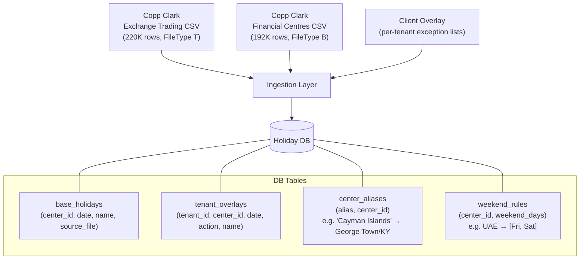
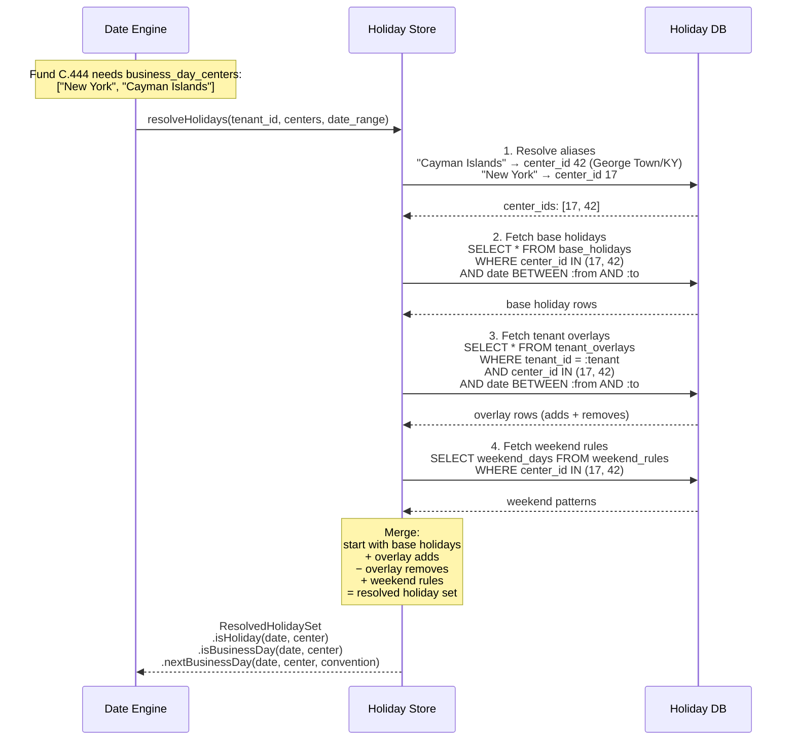
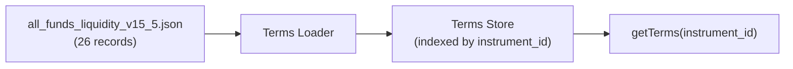
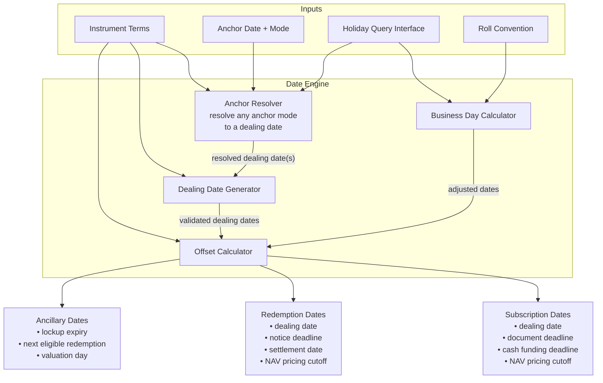
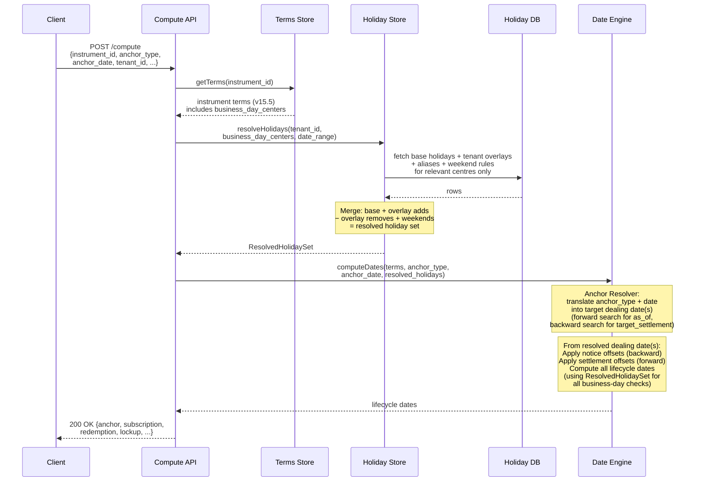
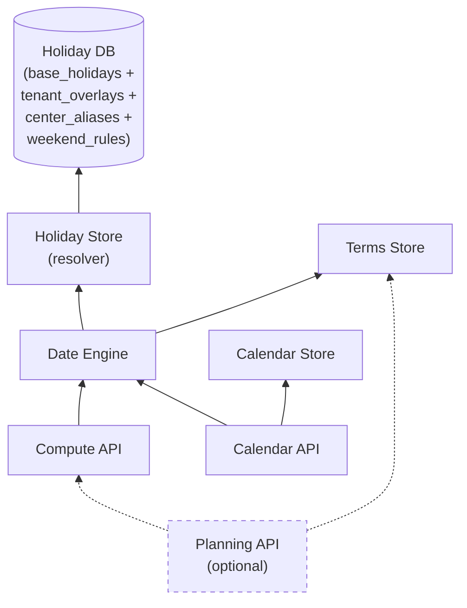

# LCS Architecture & Workflow Design

## 1. System Overview

LCS is a **deterministic date-computation service** that combines fund liquidity terms with market holiday calendars to produce canonical lifecycle dates for every instrument.

The system is split into a **core layer** (date computation — not debated) and an **optional planning layer** (liquidation simulation through gates/holdbacks — under discussion). The architecture treats these as cleanly separable: the planning layer consumes the core layer's output but never contaminates it.

```
┌─────────────────────────────────────────────────────────────────────┐
│                         LCS Service                                 │
│                                                                     │
│  ┌────────────────────────────────────────────────────────────────┐ │
│  │                     CORE (deterministic)                       │ │
│  │                                                                │ │
│  │   ┌──────────────┐   ┌──────────────┐   ┌─────────────────┐    │ │
│  │   │ Holiday Store│   │ Terms Store  │   │   Date Engine   │    │ │
│  │   │              │   │              │   │                 │    │ │
│  │   │ Copp Clark   │   │ v15.5 fund   │   │ Roll conventions│    │ │
│  │   │ + overlays   │   │ liquidity    │   │ Biz-day math    │    │ │
│  │   │              │   │ records      │   │ Dealing-date    │    │ │
│  │   │              │   │              │   │ generation      │    │ │
│  │   └──────┬───────┘   └──────┬───────┘   └────────┬────────┘    │ │
│  │          │                  │                     │            │ │
│  │          └──────────────────┼─────────────────────┘            │ │
│  │                             │                                  │ │
│  │               ┌─────────────┴─────────────┐                    │ │
│  │               │                           │                    │ │
│  │        ┌──────▼──────┐            ┌───────▼───────┐            │ │
│  │        │ Compute API │            │ Calendar API  │            │ │
│  │        │ (stateless) │            │ (persisted)   │            │ │
│  │        └─────────────┘            └───────────────┘            │ │
│  └────────────────────────────────────────────────────────────────┘ │
│                                                                     │
│  ┌ ─ ─ ─ ─ ─ ─ ─ ─ ─ ─ ─ ─ ─ ─ ─ ─ ─ ─ ─ ─ ─ ─ ─ ─ ─ ─ ─ ─ - - ┐    │
│    OPTIONAL — Liquidation Planning (under discussion)               │
│  │                                                             |    │
│     ┌────────────────────────────────────────────────────────┐      │
│  │  │ Planning Engine                                        │ │    │
│     │ Consumes: Compute API output + position data           │      │
│  │  │ Applies:  gates, holdbacks, lockup constraints         │ │    │
│     │ Returns:  tranche schedule (amount × date × status)    │      │
│  │  └────────────────────────────────────────────────────────┘ │    │
│                                                                     │
│  │  ┌──────────────────┐                                       │    │
│     │ Planning API     │                                            │
│  │  └──────────────────┘                                       │    │
│  └ ─ ─ ─ ─ ─ ─ ─ ─ ─ ─ ─ ─ ─ ─ ─ ─ ─ ─ ─ ─ ─ ─ ─ ─ ─ ─ ─ ─ - - ┘    │
└─────────────────────────────────────────────────────────────────────┘
```

---

## 2. Component Architecture

### 2.1 Holiday Store

Responsible for persisting, merging, and querying holiday data. Both the base Copp Clark calendars and tenant-specific overlays live in the database. At request time, the store fetches only the relevant centres for the fund being computed, applies the tenant's overlays, and resolves the final holiday set.

#### Data Ingestion (write path)

Copp Clark files and client overlays are ingested into the DB separately. They are never mixed at rest — merging happens at query time.



#### Holiday Resolution (read path)

When the Compute or Calendar API processes a request, the Holiday Store resolves holidays on the fly for the specific tenant + fund combination:



The returned `ResolvedHolidaySet` is an in-memory object scoped to this single request. The Date Engine uses it for all business-day calculations during that computation. This means:
- Different tenants get different holiday sets (same Copp Clark base, different overlays)
- The DB is the single source of truth — no stale in-memory caches to invalidate
- Only the centres relevant to the fund are fetched, not the entire 400K-row dataset

#### DB Schema

```sql
-- Base holidays from Copp Clark (both Exchange Trading and Financial Centres)
CREATE TABLE base_holidays (
    id              BIGINT PRIMARY KEY,
    center_id       INT NOT NULL,           -- Copp Clark CenterID
    source_type     VARCHAR(2) NOT NULL,     -- 'T' (exchange trading) or 'B' (financial centre)
    date            DATE NOT NULL,
    event_name      VARCHAR(255),
    country_code    CHAR(2),                -- ISO country
    currency_code   CHAR(3),                -- ISO currency (Financial Centres only)
    mic_code        VARCHAR(10),            -- ISO MIC (Exchange Trading only)
    source_file_id  INT NOT NULL,           -- which Copp Clark file version this came from
    ingested_at     TIMESTAMPTZ NOT NULL,
    UNIQUE (center_id, date, source_type)
);

-- Tenant-specific holiday overrides
CREATE TABLE tenant_overlays (
    id              BIGINT PRIMARY KEY,
    tenant_id       VARCHAR(50) NOT NULL,
    center_id       INT NOT NULL,
    date            DATE NOT NULL,
    action          VARCHAR(6) NOT NULL,     -- 'add' or 'remove'
    event_name      VARCHAR(255),           -- reason for the override
    created_by      VARCHAR(100),
    created_at      TIMESTAMPTZ NOT NULL,
    UNIQUE (tenant_id, center_id, date)
);

-- Alias mapping: fund terms use display names, Copp Clark uses city names
CREATE TABLE center_aliases (
    alias           VARCHAR(100) NOT NULL,  -- e.g. "Cayman Islands"
    center_id       INT NOT NULL,           -- maps to Copp Clark CenterID
    display_name    VARCHAR(100),           -- e.g. "George Town"
    country_code    CHAR(2),
    PRIMARY KEY (alias)
);

-- Weekend patterns per centre (not in Copp Clark data)
CREATE TABLE weekend_rules (
    center_id       INT PRIMARY KEY,
    weekend_days    VARCHAR(20) NOT NULL    -- e.g. "sat,sun" or "fri,sat"
);
```

**Key design decisions:**

| Concern | Decision |
|---|---|
| **Merge happens at query time, not at ingestion** | Base holidays and overlays are stored separately. This makes it easy to re-ingest a new Copp Clark file without touching overlays, and to audit exactly what a tenant has overridden. |
| **Resolved set is per-request, in-memory** | The Holiday Store fetches from DB, merges, and returns an in-memory object that lives for the duration of one computation. No long-lived cache to invalidate. |
| **Only relevant centres are fetched** | A fund with `business_day_centers: ["New York", "Cayman Islands"]` triggers a query for 2 centres, not 417. Keeps queries fast. |
| **Center alias resolution** | Fund terms say "Cayman Islands"; Copp Clark says "George Town" (CenterID 42). The `center_aliases` table resolves this. The alias table is the only place this mapping lives — no other component needs to know about the mismatch. |
| **Overlay semantics** | An overlay entry with `action: "add"` creates a new holiday. `action: "remove"` deletes a Copp Clark holiday for that tenant (the tenant considers it a working day). A remove for a date that isn't in Copp Clark is a no-op. |
| **Weekend rules** | Copp Clark doesn't list weekends as holidays. The `weekend_rules` table encodes per-centre patterns (Sat–Sun for most; Fri–Sat for UAE/Saudi; Sun-only for Israel, etc.). The resolved set uses these when answering `isBusinessDay`. |
| **Copp Clark versioning** | Each ingested file is tracked by `source_file_id`. When a new Copp Clark file arrives, new rows are inserted and old ones from the previous file can be diffed to detect which holidays changed — this drives the Calendar API's recomputation trigger. |

### 2.2 Terms Store

Loads and indexes the v15.5 fund liquidity terms. Provides lookup by `instrument_id` / `fund_id` / `class_id`.



**Indexing:** Records are keyed by `instrument.instrument_id` (= `class_id`). The store supports lookup by fund_id (returns all classes for that fund) or by individual class_id.

**Versioning:** Each record carries `metadata.fund_terms_version`. When terms are updated, the store accepts new versions and the Calendar API triggers recomputation for affected instruments.

### 2.3 Date Engine (Core Computation)

The pure-function heart of LCS. Given an instrument's terms, an anchor, and a holiday-query interface, it produces deterministic lifecycle dates.

The engine supports **multi-directional anchoring** — the caller can pin any one lifecycle date and the engine derives all others:

| Anchor mode | Direction | Example |
|---|---|---|
| `as_of` | Forward | "Starting from today, find next dealing dates" → derive deadlines forward |
| `target_settlement_date` | Backward | "I need cash by Oct 31" → find latest dealing date whose settlement is ≤ Oct 31 → derive notice deadline backward |
| `target_dealing_date` | Both | "I know the dealing date is Oct 1" → derive notice backward, settlement forward |
| `target_notice_deadline` | Forward | "I can submit notice by Jul 3" → find earliest dealing date this catches → derive settlement forward |

Internally, every mode resolves to a **dealing date** first, then derives all other dates from it. The Dealing Date Generator either searches forward or backward depending on the anchor mode.



#### 2.3.0 Anchor Resolver

Translates any anchor mode into one or more dealing dates:

- **`as_of`** → pass through to Dealing Date Generator, search forward
- **`target_settlement_date`** → compute "dealing_date = target - settlement_days", then snap backward to the nearest valid dealing date. Uses the Offset Calculator in reverse (subtract settlement offset) and the Business Day Calculator to validate.
- **`target_dealing_date`** → validate that the given date is a valid dealing date (or snap to nearest). If invalid and snapping changes it, include a warning.
- **`target_notice_deadline`** → compute "dealing_date = notice_date + notice_days", then snap forward to the nearest valid dealing date whose notice deadline is still on or after the given date.

When no valid dealing date satisfies the constraint (e.g. the target settlement date is too soon), the engine returns the **earliest reachable** dealing date set with an explanation, so the caller knows what *is* possible.

#### 2.3.1 Dealing Date Generator

Produces the sequence of dealing dates from terms:

1. Read `dealing_basis` — if `periodic`, use `dealing_interval` (e.g. `{3, month}` = quarterly)
2. Within each period, place the dealing day per `dealing_day.anchor` + `day_type`:
   - `first/business` → first business day of the period
   - `last/calendar` → last calendar day of the period
   - `nth/business` + `ordinal: 3` → 3rd business day of the period
3. For `anniversary` basis, dealing dates fall on the anniversary of subscription, offset by `dealing_interval`
4. For `discretionary` / `complex`, the engine cannot generate dates — flag as "requires manual scheduling"

#### 2.3.2 Business Day Calculator

Adjusts a raw date to a valid business day using:

- **Holiday set:** Merged holidays for the relevant `business_day_centers`
- **Weekend rules:** Per-centre weekend configuration
- **Roll convention:**
  - **Following** — roll forward to next business day
  - **Modified Following** — roll forward, but if it crosses month-end, roll backward instead
  - **Preceding** — roll backward to previous business day
  - **Modified Preceding** — roll backward, but if it crosses month-start, roll forward instead

When multiple `business_day_centers` apply (e.g. `["New York", "Cayman Islands"]`), a date must be a business day in **all** listed centres.

#### 2.3.3 Offset Calculator

Applies `day_offset` primitives (the universal timing building block) to compute deadlines:

```
Input:  anchor_date, days, direction, day_type, business_day_centers
Output: adjusted_date, cutoff_time (if applicable)

Algorithm:
  1. Start from anchor_date
  2. Move `days` in `direction` (before/after/same_day)
     - If day_type = "calendar": count all days
     - If day_type = "business": count only business days (per centers)
  3. Apply roll convention if landing on a non-business day
  4. Attach cutoff_hour + cutoff_timezone if present in terms
```

---

## 3. Data Flow — Compute API (Stateless)



---

## 4. Data Flow — Calendar API (Persisted)


### Calendar Materialization

When triggered, the Calendar API:
1. Reads the instrument's terms from the Terms Store
2. Generates all dealing dates within the specified horizon (e.g. 24 months forward)
3. For each dealing date, calls the Date Engine to compute the full lifecycle date set
4. Writes the results to the Calendar Store with an `effective_version` timestamp
5. Diffs against the previous version to produce a changelog
6. Notifies subscribers of any date movements

### Recomputation Triggers

| Trigger | Scope | Behaviour |
|---|---|---|
| Fund terms updated | Single instrument | Recompute that instrument's calendar; changelog shows which dates moved |
| Copp Clark holiday file update | All instruments using affected centres | Identify affected instruments via `business_day_centers`; batch recompute; changelog per instrument |
| Client overlay change | Instruments using that overlay | Same as holiday update but scoped to client's instruments |
| Scheduled forward-fill | All instruments | Extend horizon as time passes (e.g. weekly cron to maintain 24-month forward window) |

---

## 5. Data Flow — Liquidation Planning API (OPTIONAL — under discussion)

> **Status:** This capability is under active debate. The architecture isolates it completely from the core date engine. It is additive — removing it has zero impact on the Compute and Calendar APIs.


### What the Planning Engine does (if built)

Given a desired redemption amount and current position, it simulates the redemption schedule:

1. **Lockup check** — Is the position still within a hard/soft lockup? If hard, no redemption is possible until expiry. If soft, flag the early-exit fee.
2. **Gate application** — Apply investor-level and fund-level gate thresholds. E.g. a 25% investor gate on a quarterly fund means at most 25% of the investor's holding can be redeemed per quarter.
3. **Tranche scheduling** — If the desired amount exceeds the gate limit, split into multiple tranches across successive dealing dates.
4. **Audit holdback** — For redemptions exceeding the holdback threshold (e.g. >=95% of account), withhold the holdback percentage (e.g. 5%) and schedule its release after audit completion.
5. **Settlement projection** — For each tranche, compute expected cash-in-hand date based on settlement terms.

**The Planning Engine never computes dates itself** — it calls the Compute API for all date math and only applies amount-level constraints on top.

---

## 6. Component Dependency Map



Dashed lines = optional dependency. The Planning API depends on the Compute API but is never depended upon. The Holiday Store is a resolver layer — it reads from the Holiday DB at request time and returns a per-request, per-tenant `ResolvedHolidaySet` to the Date Engine.

---

## 7. Key Architectural Decisions

| # | Decision | Rationale |
|---|---|---|
| 1 | **Date Engine is a pure function** — no side effects, no state, no network calls beyond the holiday-query interface | Testability, auditability. Every output is reproducible given the same inputs. |
| 2 | **Planning layer calls Compute API, never the Date Engine directly** | Clean separation. Planning is a consumer of dates, not a producer. Can be removed without touching core code. |
| 3 | **Holidays live in the DB, resolved per-request per-tenant** | Copp Clark base data and tenant overlays are stored separately in the DB. At request time, the Holiday Store fetches only the relevant centres, merges base + overlays, and hands a `ResolvedHolidaySet` to the Date Engine. No stale in-memory caches; different tenants get different holiday sets from the same base data. |
| 4 | **Centre-alias resolution is in the DB (`center_aliases` table)** | Fund terms say "Cayman Islands"; Copp Clark says "George Town". The mapping is a DB lookup, not hardcoded. New aliases are added with a row insert, not a code change. |
| 5 | **Calendar Store is effective-versioned, not mutable** | Supports "what did the calendar say on date X?" queries for audit and compliance. Old versions are never deleted, only superseded. |
| 6 | **Roll conventions are applied at the Business Day Calculator level, not the Offset Calculator** | Keeps the offset logic simple (count days) and the adjustment logic in one place. |
| 7 | **Multi-centre business day = intersection** | A date is a business day only if it's a business day in ALL listed centres. This is the standard market convention for multi-currency instruments. |
| 8 | **Weekend rules are per-centre, not global** | UAE (Fri–Sat), Israel (Fri–Sat or Sun-only depending on context), most others (Sat–Sun). Stored in `weekend_rules` table in Holiday DB. |
| 9 | **Overlays are stored separately from base data** | Base Copp Clark data can be re-ingested without touching tenant customizations. Audit trail is clear: "this holiday comes from Copp Clark" vs "this was added by the tenant." |
