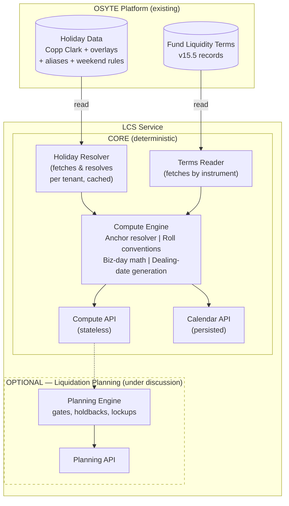
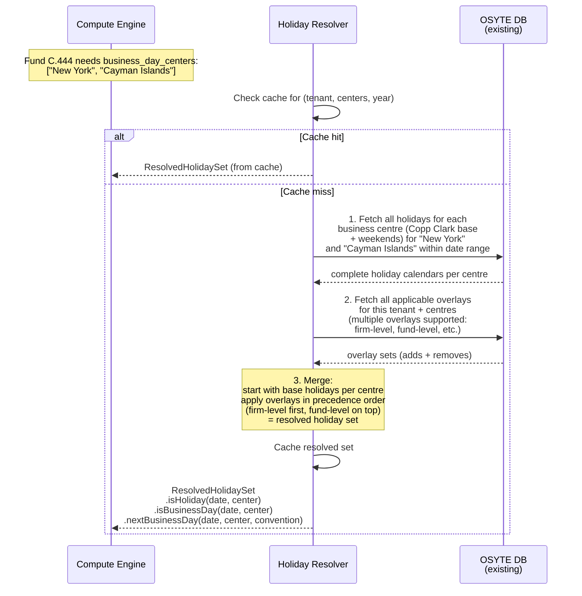
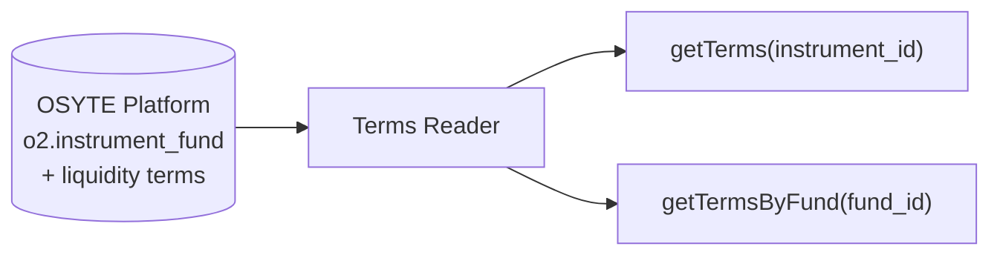
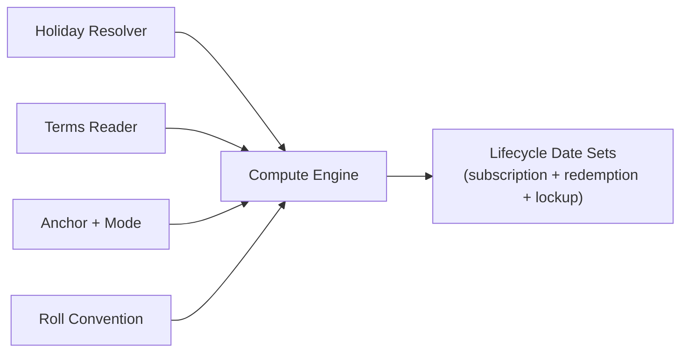
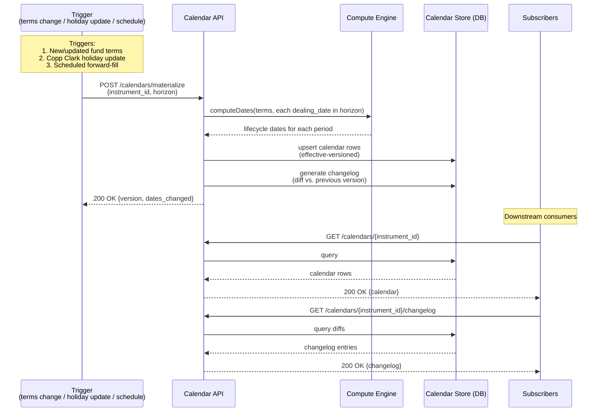
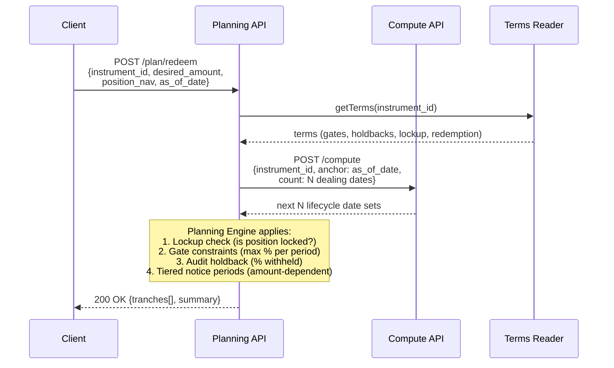
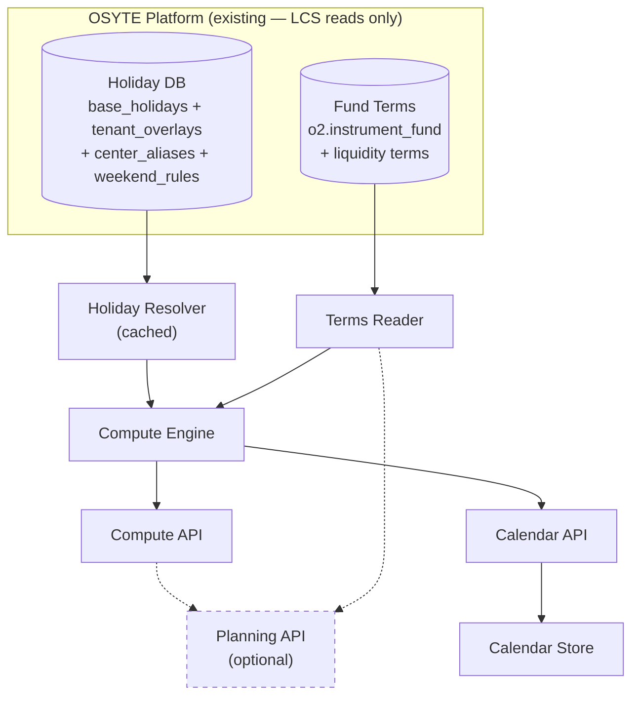

# LCS Architecture & Workflow Design

## 1. System Overview

LCS is a **deterministic date-computation service** that reads fund liquidity terms and market holiday calendars from OSYTE's existing platform and computes canonical lifecycle dates for every instrument. LCS does not own or store the source data — it reads from OSYTE and only persists its own computed output (materialized calendars).

The system is split into a **core layer** (date computation — not debated) and an **optional planning layer** (liquidation simulation through gates/holdbacks — under discussion). The architecture treats these as cleanly separable: the planning layer consumes the core layer's output but never contaminates it.



---

## 2. Component Architecture

### 2.1 Holiday Resolver

Reads holiday data from OSYTE's existing DB (Copp Clark base holidays, tenant overlays, centre aliases, weekend rules) and merges it into a resolved holiday set for each computation request. LCS does not ingest, store, or manage any holiday data — that's all handled by the OSYTE platform.

#### Holiday Resolution

When the Compute or Calendar API processes a request, the Holiday Resolver fetches the relevant data from OSYTE's DB and resolves it for the specific tenant + fund combination. The steps are:

1. **Fetch all holidays for the business centre** — pull the complete holiday calendar (Copp Clark base including weekends) for each centre the fund references
2. **Fetch all applicable overlays** — a tenant can have multiple overlays that apply to the same centre (e.g. a firm-level overlay and a fund-level overlay). All matching overlays are fetched.
3. **Merge into a resolved set** — start with the base holidays, then apply each overlay in precedence order (adds and removes), producing the final resolved holiday set



The returned `ResolvedHolidaySet` is an in-memory object that the Compute Engine uses for all business-day calculations during that computation. This means:
- Different tenants get different holiday sets (same Copp Clark base, different overlays)
- Multiple overlays are supported per tenant per centre (e.g. firm-level + fund-level), applied in precedence order
- Only the centres relevant to the fund are fetched, not the entire 400K-row dataset

#### Caching

A small number of centres dominate traffic — US (New York) and GB (London) appear in the vast majority of fund terms. Hitting the DB for these on every request is wasteful.

The Holiday Resolver maintains a **two-tier cache**:

| Tier | What's cached | Key | TTL | Invalidation |
|---|---|---|---|---|
| **Base calendar cache** | Copp Clark holidays for a centre + date range | `(center_id, year)` | Long-lived (until OSYTE signals a Copp Clark update) | Evict entries for affected centres when notified of a data update |
| **Resolved set cache** | Fully merged holiday set (base + all tenant overlays) for a tenant + centre + date range | `(tenant_id, center_id, year)` | Short-lived (minutes) or event-driven | Evict when notified of any overlay change for that tenant + centre |

**How it works:**
1. Request comes in for tenant `acme`, centres `["New York", "London"]`, date range 2026
2. Check resolved set cache for `(acme, new_york, 2026)` and `(acme, london, 2026)` — **cache hit** on most requests since these are the popular centres
3. On cache miss: check base calendar cache for `(new_york, 2026)` — almost always warm since US/GB base calendars are requested constantly
4. Fetch all applicable overlays for this tenant + centre from OSYTE DB (multiple overlay layers supported)
5. Merge base + overlays in precedence order, cache the resolved set, return

Weekend rules and centre aliases are cached indefinitely (they change approximately never).

Since most tenants have few or zero overlays for the popular centres, the resolved set cache has a very high hit rate — the base calendar is shared, and the overlay diff is typically small.

**Key design decisions:**

| Concern | Decision |
|---|---|
| **Read-only — LCS doesn't own holiday data** | All holiday data (Copp Clark, overlays, aliases, weekend rules) lives in OSYTE's existing DB. The Holiday Resolver is a read-only client with caching. |
| **Two-tier cache for popular centres** | Base calendars (US, GB, etc.) are cached long-lived. Resolved sets (base + tenant overlay) are cached with short TTL or event-driven invalidation. Most requests hit cache — DB is only touched for cold centres or after data changes. |
| **Only relevant centres are fetched** | A fund with `business_day_centers: ["New York", "Cayman Islands"]` triggers a query for 2 centres, not 417. Keeps queries fast. |
| **Centre alias resolution** | Fund terms say "Cayman Islands"; OSYTE's alias table maps it to "George Town" (CenterID 42). The Holiday Resolver handles this transparently — no other component needs to know about the mismatch. |
| **Multiple overlays per tenant** | A tenant can have multiple overlay layers per centre (e.g. firm-level and fund-level). They are applied in precedence order during merge. An overlay entry with `action: "add"` creates a new holiday; `action: "remove"` suppresses a base or lower-precedence holiday. A remove for a date that doesn't exist is a no-op. |
| **Weekend rules** | Copp Clark doesn't list weekends. OSYTE stores per-centre weekend patterns (Sat–Sun for most; Fri–Sat for UAE/Saudi; Sun-only for Israel, etc.). The resolved set uses these when answering `isBusinessDay`. |

### 2.2 Terms Reader

LCS does not store fund liquidity terms — they already live in OSYTE's platform (e.g. `o2.instrument_fund`). The Terms Reader is a thin client that fetches terms on demand.



**Lookup:** By `instrument_id` (single class) or `fund_id` (all classes for a fund). The reader expects v15.5 schema records.

**Versioning:** Each record carries `metadata.fund_terms_version`. When OSYTE notifies LCS that terms have changed, the Calendar API triggers recomputation for affected instruments. The Terms Reader always fetches the current version — it has no local cache or copy.

### 2.3 Compute Engine

The pure-function heart of LCS. Takes instrument terms, a resolved holiday set, an anchor, and a roll convention → produces deterministic lifecycle dates.



#### Core Algorithm

Regardless of the anchor mode, the engine always follows the same loop:

1. **Find the nearest dealing date** from the anchor
2. **Compute the full lifecycle chain** for that dealing date (notice deadline, settlement date, etc.)
3. **Check if it satisfies the anchor constraint** — if yes, include it in results; if no, skip to the next dealing date
4. **Repeat** until N results are collected or no more dealing dates exist in the search window

This is simple and correct because offsets + roll conventions + multi-centre holidays are non-invertible — you can't reliably work backward from a settlement date by subtracting days. Instead, you find dealing dates, compute forward from each, and check.

**Per anchor mode:**

| `anchor_type` | "Nearest" means | Constraint check |
|---|---|---|
| `as_of` | Next dealing date ≥ anchor | Always passes (just generate forward) |
| `target_settlement_date` | Nearest dealing date before anchor | Does `settlement_date ≤ target`? |
| `target_dealing_date` | Nearest valid dealing date to the given date | Is this date a valid dealing date? If not, snap and warn. |
| `target_notice_deadline` | Next dealing date after anchor | Is `notice_deadline ≥ anchor`? (i.e. can the caller still submit notice in time?) |

When no dealing date satisfies the constraint, the engine returns the **nearest reachable** set with an explanation.

#### Dealing Dates

A fund can have **multiple dealing days** per period (e.g. 1st and 15th, stored as `%+%` in OSYTE). The engine iterates all dealing days per period in a single pass, generating an independent lifecycle chain for each. Results are returned **chronologically sorted** across all dealing day types.

**Dealing basis:**

| `dealing_basis` | Schedulable? | Behaviour |
|---|---|---|
| `periodic` | Yes | Recurring on `dealing_interval` (e.g. `{3, month}` = quarterly) |
| `anniversary` | Yes | Recurring on subscription anniversary + `dealing_interval` |
| `at_closing` | No | Subscription only — deals at fund closing |
| `at_maturity` | No | Redemption only — deals at fund maturity |
| `discretionary` | No | Manager determines timing |
| `complex` | No | Irregular structure — refer to `redemption_schedule` |

Unschedulable bases return `dates: []` with a warning.

#### Business Day Adjustment

Every computed date must land on a valid business day. Roll conventions handle the adjustment:

| Convention | Rule |
|---|---|
| **Following** | Roll forward to next business day |
| **Modified Following** | Roll forward, but if that crosses month-end, roll backward instead |
| **Preceding** | Roll backward to previous business day |
| **Modified Preceding** | Roll backward, but if that crosses month-start, roll forward instead |

> **Known schema gap:** The v15.5 schema has no `roll_convention` field. Currently accepted as an API parameter (default: Modified Following). Recommend adding it to the schema per-instrument.

**Centre precedence:** Some terms carry their own `business_day_centers` at the rule level (e.g. `notice_period.business_day_centers: ["London", "Dublin"]`). When present, these override instrument-level centres for that calculation. When multiple centres apply, a date must be a business day in **all** of them.

#### Completeness Gate

Before computing, the engine checks `availability` and `value_type` on every field it needs:

- `populated` → use the value
- `not_applicable` → skip, no warning
- `unknown` / `not_assessed` → return null + warning

When availability is `populated`, `value_type` adds caveats: `exact` = no caveat; `minimum` / `maximum` / `estimated` / `discretionary` = result is flagged as approximate.

The engine also collects all `considerations` (INFO/WARN/ACTION) from the terms and surfaces them in the response.

---

## 3. Data Flow — Compute API (Stateless)


---

## 4. Data Flow — Calendar API (Persisted)



### Calendar Materialization

When triggered, the Calendar API:
1. Reads the instrument's terms from the Terms Reader
2. Generates all dealing dates within the specified horizon (e.g. 24 months forward)
3. For each dealing date, calls the Compute Engine to compute the full lifecycle date set
4. Writes the results to the Calendar Store with an `effective_version` timestamp
5. Diffs against the previous version to produce a changelog
6. Notifies subscribers of any date movements

### Recomputation Triggers

| Trigger | Scope | Behaviour |
|---|---|---|
| Fund terms updated | Single instrument | Recompute that instrument's calendar; changelog shows which dates moved |
| Copp Clark holiday file update | All instruments using affected centres | Identify affected instruments via `business_day_centers`; batch recompute; changelog per instrument |
| Client overlay change | Instruments using that overlay | Same as holiday update but scoped to client's instruments |
| Scheduled forward-fill | All instruments | Extend horizon as time passes (e.g. weekly cron to maintain 24-month forward window) |

Materialization is **async** — the API returns `202 Accepted` with a `job_id`. The job runs in the background; callers poll `GET /jobs/{job_id}` for status. Jobs are idempotent on `(tenant_id, instrument_id, reason)`.

### Calendar Store Schema

The Calendar Store is the **one thing LCS owns** — it persists the materialized output. It is effective-versioned: every materialization creates a new version; old versions are never deleted, enabling "what did the calendar say on date X?" queries.

```sql
-- One row per materialization run per instrument
CREATE TABLE calendar_versions (
    version_id          BIGSERIAL PRIMARY KEY,
    tenant_id           VARCHAR(50) NOT NULL,
    instrument_id       VARCHAR(50) NOT NULL,
    effective_from      TIMESTAMPTZ NOT NULL,  -- when this version became current
    superseded_at       TIMESTAMPTZ,           -- when the next version replaced it (null = current)
    trigger_reason      VARCHAR(30) NOT NULL,   -- holiday_data_update | terms_update | overlay_change | scheduled_refresh
    dataset_version     JSONB NOT NULL,         -- {holiday_file_id, terms_version, overlay_hash}
    horizon_from        DATE NOT NULL,
    horizon_to          DATE NOT NULL,
    created_at          TIMESTAMPTZ NOT NULL,
    UNIQUE (tenant_id, instrument_id, effective_from)
);

-- One row per lifecycle date per dealing date per version
CREATE TABLE calendar_dates (
    id                  BIGSERIAL PRIMARY KEY,
    version_id          BIGINT NOT NULL REFERENCES calendar_versions(version_id),
    scope               VARCHAR(12) NOT NULL,   -- 'subscription' | 'redemption'
    dealing_day_label   VARCHAR(50),            -- e.g. "1st business day", "15th"
    dealing_date        DATE NOT NULL,
    notice_deadline     DATE,                   -- redemption only
    settlement_date     DATE,                   -- redemption only
    document_deadline   DATE,                   -- subscription only
    cash_funding_deadline DATE,                 -- subscription only
    nav_pricing_cutoff  DATE,
    cutoff_time         TIME,
    cutoff_timezone     VARCHAR(50),
    roll_applied        VARCHAR(20),            -- null | following | modified_following | ...
    unadjusted_date     DATE,                   -- dealing date before roll (null if no adjustment)
    UNIQUE (version_id, scope, dealing_date, dealing_day_label)
);

-- Changelog: what moved between versions
CREATE TABLE calendar_changelog (
    id                  BIGSERIAL PRIMARY KEY,
    version_id          BIGINT NOT NULL REFERENCES calendar_versions(version_id),
    previous_version_id BIGINT REFERENCES calendar_versions(version_id),
    scope               VARCHAR(12) NOT NULL,
    dealing_date        DATE NOT NULL,
    field_name          VARCHAR(30) NOT NULL,   -- e.g. 'notice_deadline', 'settlement_date'
    previous_value      DATE,
    new_value           DATE,
    reason              TEXT                     -- e.g. "New York holiday added; deadline rolled"
);
```

---

## 5. Data Flow — Liquidation Planning API (OPTIONAL — under discussion)

> **Status:** This capability is under active debate. The architecture isolates it completely from the core date engine. It is additive — removing it has zero impact on the Compute and Calendar APIs.



### What the Planning Engine does (if built)

Given a desired redemption amount and current position, it simulates the redemption schedule:

1. **Lockup check** — Is the position still within a hard/soft lockup? If hard, no redemption is possible until expiry. If soft, flag the early-exit fee.
2. **Gate application** — Apply investor-level and fund-level gate thresholds. E.g. a 25% investor gate on a quarterly fund means at most 25% of the investor's holding can be redeemed per quarter.
3. **Tranche scheduling** — If the desired amount exceeds the gate limit, split into multiple tranches across successive dealing dates.
4. **Audit holdback** — For redemptions exceeding the holdback threshold (e.g. >=95% of account), withhold the holdback percentage (e.g. 5%) and schedule its release after audit completion.
5. **Settlement projection** — For each tranche, compute expected cash-in-hand date based on settlement terms.

**The Planning Engine never computes dates itself** — it calls the Compute API for all date math and only applies amount-level constraints on top.

---

## 6. Component Dependency Map



Data flows top-down: OSYTE platform data → Holiday Resolver / Terms Reader → Compute Engine → APIs. Dashed lines = optional dependency. The Planning API depends on the Compute API but is never depended upon. LCS owns no data stores except the Calendar Store (materialized calendars); everything else is read from OSYTE. The Holiday Resolver caches popular base calendars (US, GB) and resolved sets to avoid repeated DB hits.

---

## 7. Key Architectural Decisions

| # | Decision | Rationale |
|---|---|---|
| 1 | **LCS owns no source data — it reads from OSYTE** | Holiday data, fund terms, overlays, and aliases all live in OSYTE's existing platform. LCS only owns the Calendar Store (materialized output). This avoids data duplication and keeps OSYTE as the single source of truth. |
| 2 | **Compute Engine is a pure function** — no side effects, no state | Given the same terms + holidays + anchor + roll convention, it always produces the same output. Testability, auditability, reproducibility. |
| 3 | **Planning layer calls Compute API, never the Compute Engine directly** | Clean separation. Planning is a consumer of dates, not a producer. Can be removed without touching core code. |
| 4 | **Holidays resolved per-tenant with two-tier cache** | The Holiday Resolver caches popular base calendars (US, GB) long-lived and resolved sets (base + overlay) short-lived. On cache miss, it fetches only the relevant centres from OSYTE's DB and merges. Cache is invalidated when OSYTE signals a data update. Different tenants get different resolved sets from the same base data. |
| 5 | **Centre-alias resolution is in the DB (`center_aliases` table)** | Fund terms say "Cayman Islands"; Copp Clark says "George Town". The mapping is a DB lookup in OSYTE, not hardcoded. New aliases are added with a row insert, not a code change. |
| 6 | **Calendar Store is effective-versioned, not mutable** | Supports "what did the calendar say on date X?" queries for audit and compliance. Old versions are never deleted, only superseded. |
| 7 | **Roll conventions are applied at the Business Day Calculator level, not the Offset Calculator** | Keeps the offset logic simple (count days) and the adjustment logic in one place. All four standard conventions supported: Following, Modified Following, Preceding, Modified Preceding. |
| 8 | **Multi-centre business day = intersection** | A date is a business day only if it's a business day in ALL listed centres. This is the standard market convention for multi-currency instruments. |
| 9 | **Weekend rules are per-centre, not global** | UAE (Fri–Sat), Israel (Fri–Sat or Sun-only depending on context), most others (Sat–Sun). Stored in OSYTE's `weekend_rules` table. |
| 10 | **Completeness gate before computation** | The engine inspects `availability` and `value_type` on every required driver before computing. Unpopulated required fields → null result + warning. Estimated/minimum/discretionary values → computed result + caveat. |
| 11 | **Dataset version stamp on every response** | The compute response includes `{holiday_file_id, terms_version, overlay_hash}`. Given the same inputs + dataset version, the engine produces the same output. Enables audit trail and replay. |
| 12 | **Search-and-verify for backward anchoring** | Reverse anchor modes (target_settlement_date, target_notice_deadline) enumerate candidate dealing dates and forward-compute each, rather than naively inverting offsets. Offsets + roll conventions are non-invertible. |

---

## 8. Security & Entitlements

LCS is a multi-tenant service. Tenant isolation is enforced at the API boundary.

| Concern | Approach |
|---|---|
| **Authentication** | Every API request carries a bearer token. The token is validated against OSYTE's auth service. |
| **Tenant binding** | The `tenant_id` in each request is verified against the token's claims. A token for tenant A cannot query tenant B's overlays or calendars. |
| **Holiday data isolation** | Base Copp Clark data is shared across all tenants (read-only). Tenant overlays are scoped by `tenant_id` — a tenant can only read/write their own. |
| **Calendar Store isolation** | Materialized calendars are keyed by `(tenant_id, instrument_id)`. A tenant can only read their own calendars. |
| **Fund terms access** | The Terms Reader inherits OSYTE's existing entitlement model — a tenant can only fetch terms for instruments they are entitled to. |
| **Planning API** (if built) | Position data (NAV, desired_amount) is never persisted by LCS. It is accepted in the request, used for computation, and discarded. |

