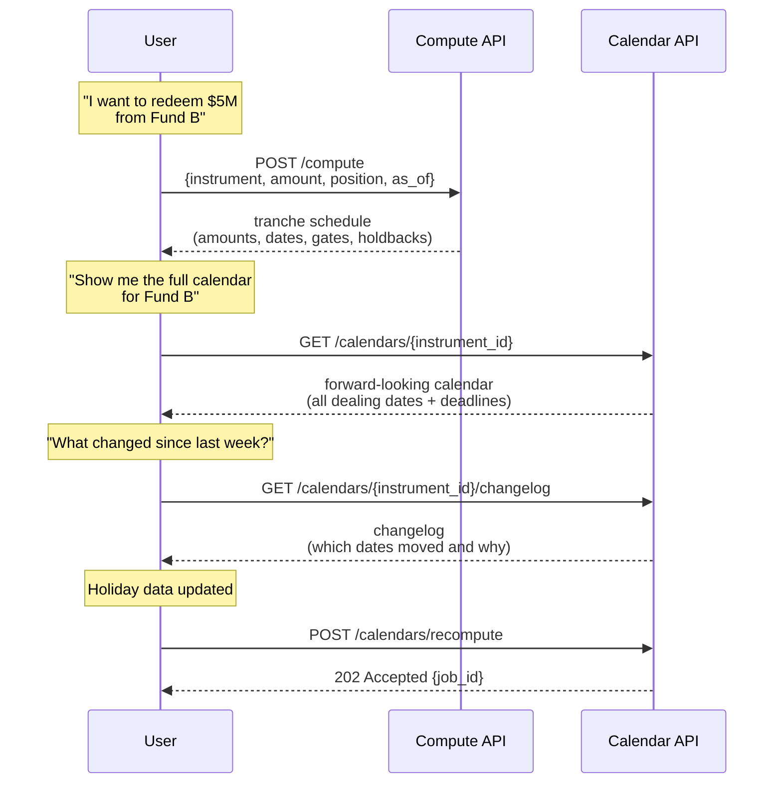
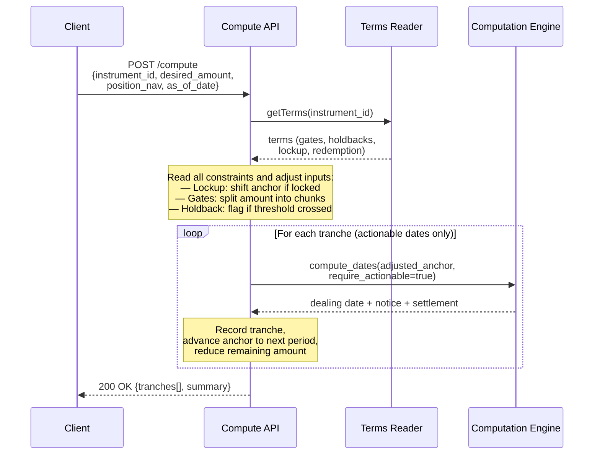
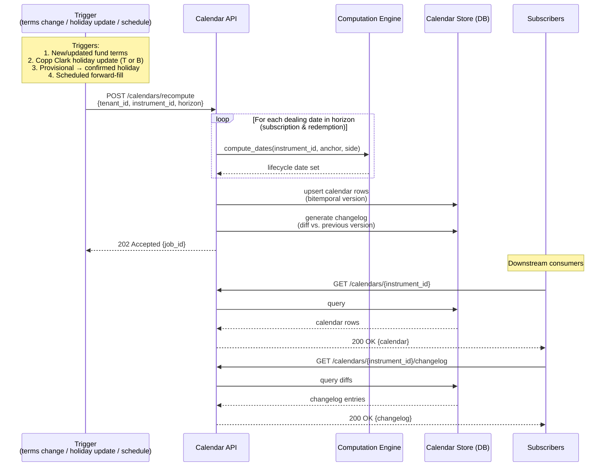
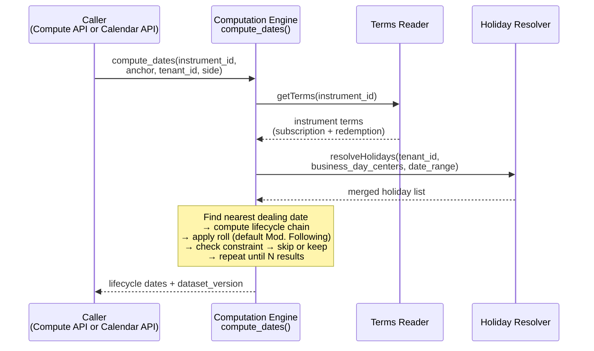

# LCS Architecture

The Liquidity Calendar Service (LCS) computes instrument-level lifecycle dates (notification, trade/dealing, valuation, settlement), serves persisted forward calendars, and simulates redemption schedules. It reads fund liquidity terms and holiday calendars from OSYTE's existing platform and persists only the materialized calendars it produces.

## Running Examples

Two funds are used throughout. Subscription (buy) and redemption (sell) carry **independent terms**, so the examples treat them separately.

**Fund A — Simple (a listed asset, e.g. a stock or ETF):** Subscription and redemption are both daily. No notice period, no lockup, no gates, no holdback. T+1 settlement. Business-day centres: `["London"]`.

**Fund B — Complex (a hedge fund):**
- *Subscription:* monthly, 1st business day of each month.
- *Redemption:* quarterly, 1st business day of each quarter; 30 calendar-day notice; 30 calendar-day settlement.
- 12-month hard lockup from subscription; 25% investor gate per quarter; 5% audit holdback on redemptions ≥ 95% of account.
- Business-day centres: `["New York", "Cayman Islands"]`.

---

## 1. System Overview

LCS reads fund liquidity terms and holiday calendars from OSYTE, computes lifecycle dates, and simulates redemption schedules. It does not store source data — it reads from OSYTE and only persists materialized calendars.

Two APIs, one shared library:

| API | Purpose |
|---|---|
| **Compute API** | Liquidation planning — reads constraints (lockups, gates, holdbacks), adjusts inputs, then calls the Computation Engine per tranche to get dates. |
| **Calendar API** | Persisted forward-looking calendars. Calls the Computation Engine in a loop to recompute, then serves from the Calendar Store. |

Both APIs import the same **Computation Engine** — a shared library containing the date engine, Holiday Resolver, and Terms Reader. The engine computes everything; the APIs are just consumers of it. No HTTP calls between them, no code duplication. Change the engine once, both APIs get the update.

If a team needs **raw dates with no planning layer**, that is a thin wrapper over the library — expose `compute_dates()` as an endpoint, with no constraint logic. It is a deployment detail, not a third architectural surface.

Effective-dated history reads (`?as_of=`), a natural-language query layer, and an MCP server are delivered in Phase 2 as read-only capabilities over the same engine output, scoped to the requester's entitlements. The Calendar Store is built bitemporally from the start, so Phase 2 needs no schema change.



### Codebase structure

```
lcs/
  computation_engine/       ← shared library, imported by both APIs
    engine.py               ← find-check-skip algorithm
    holidays.py             ← Holiday Resolver (fetch T/B, merge overlays, cache)
    terms.py                ← Terms Reader (OSYTE adapters; subscription + redemption)
    compute.py              ← wires HR + TR + engine together; exposes compute_dates()

  compute_api/              ← imports computation_engine/
    routes.py               ← reads constraints, calls compute_dates() per tranche

  calendar_api/             ← imports computation_engine/
    calendar_routes.py      ← /calendars endpoints + /jobs
    recompute.py            ← loops dealing dates (subscription + redemption), calls compute_dates()
    store.py                ← Calendar Store (read/write, bitemporal)
    subscriptions.py        ← webhook delivery for calendar.updated
```

---

## 2. Compute API

Handles liquidation planning. Reads the instrument's constraints (lockups, gates, holdbacks), adjusts inputs accordingly, then calls `compute_dates()` per tranche to get dates.

**What it does:**
1. **Read constraints** from the instrument terms.
2. **Adjust inputs** before any date computation:
   - Hard lockup active? → shift anchor to lockup expiry
   - Soft lockup? → flag early-exit fee, proceed
   - Amount exceeds gate? → split into max-per-period chunks
   - Holdback threshold crossed? → flag holdback on the relevant tranche
3. **Call the engine per tranche** with the adjusted anchor, requesting **actionable dates only** (notice window still open).
4. **Return the schedule** — tranches with amounts, dates, and any fees/holdbacks.

### Workflow



### Example — Fund A: Redeem $1M, as of 2026-07-01

```
Read constraints:
  Lockup?    No   → no adjustment
  Gates?     None → no split
  Holdback?  No   → skip

Nothing to adjust — call the engine directly.

compute_dates(anchor=2026-07-01)
  → Dealing: Jul 1 | Notice: n/a | Settlement: Jul 2

Result: 1 tranche
┌─────────┬────────────┬────────┬─────────┬────────┐
│ Tranche │ Amount     │ Notice │ Dealing │ Cash   │
├─────────┼────────────┼────────┼─────────┼────────┤
│ 1       │ $1,000,000 │ n/a    │ Jul 01  │ Jul 02 │
└─────────┴────────────┴────────┴─────────┴────────┘
```

### Example — Fund B: Redeem $5M from $8M position, subscribed 2025-01-15, as of 2026-07-01

```
Read constraints:
  Lockup?    Hard, 12 months from 2025-01-15 → expires 2026-01-15
             as_of (Jul 1) > expiry (Jan 15) → unlocked. Proceed.
             (If as_of were 2025-06-01, anchor would shift to 2026-01-15.)
  Gates?     25% of holding per quarter → $2M max/quarter
             $5M ÷ $2M = 3 tranches needed
  Holdback?  5% if ≥ 95% of account
             $5M / $8M = 62.5% → NOT triggered

Engine calls (one per tranche, require_actionable=true):
  T1: compute_dates(anchor=2026-07-01)
      Jul 1's dealing date needs notice by Jun 1 — already passed → engine skips to Q4
      → Dealing: Oct 1 | Notice: Sep 1 | Settlement: Oct 30   (Oct 31 is a Sat → Mod. Following rolls back to Fri Oct 30)
  T2: compute_dates(anchor=2026-10-02)
      → Dealing: Jan 4 | Notice: Dec 4 | Settlement: Feb 3   (Jan 1 holiday → dealing Jan 4; Dec 5 notice is Sat → preceding Fri Dec 4)
  T3: compute_dates(anchor=2027-01-05)
      → Dealing: Apr 1 | Notice: Mar 2 | Settlement: May 4   (May 1 is Sat + May 3 a Cayman holiday → settles Tue May 4)

Result: 3 tranches
┌─────────┬────────────┬────────┬─────────┬────────┬───────────┐
│ Tranche │ Amount     │ Notice │ Dealing │ Cash   │ Gate-ltd? │
├─────────┼────────────┼────────┼─────────┼────────┼───────────┤
│ 1       │ $2,000,000 │ Sep 01 │ Oct 01  │ Oct 30 │ Yes       │
│ 2       │ $2,000,000 │ Dec 04 │ Jan 04  │ Feb 03 │ Yes       │
│ 3       │ $1,000,000 │ Mar 02 │ Apr 01  │ May 04 │ No        │
└─────────┴────────────┴────────┴─────────┴────────┴───────────┘

Total: $5M | First cash: Oct 30 | Last cash: May 4 | Holdback: $0 | Exit fee: $0
(Dates verified against the NY + Cayman Islands holiday calendars. Forward dates roll Modified
 Following; notice deadlines roll Preceding so a deadline never slips later — see §4.)
```

The Q3 dealing date (Jul 1) is skipped because its notice window had already closed as of Jul 1 — the engine reports this rather than silently dropping it (see §4, notice feasibility).

---

## 3. Calendar API

Separate API from Compute. Uses the same Computation Engine to recompute forward-looking calendars, then serves them from the Calendar Store. Calendars carry **both subscription and redemption** dealing sequences, labelled by `side` — a fund that subscribes monthly but redeems quarterly has two independent date streams stored together.

**What it does:**
1. On trigger (terms change, holiday update, provisional confirmation, scheduled refresh), recomputes the calendar for affected instruments.
2. For each dealing date in the horizon — for each side — calls `compute_dates()` directly (in-process, no HTTP).
3. Writes results to the Calendar Store (bitemporal — old versions never deleted).
4. Diffs against the previous version → changelog showing which dates moved and why.
5. Serves calendars and changelogs to downstream consumers.

### Workflow



Recomputation is **async** — returns `202 Accepted` with a `job_id`. Poll `GET /jobs/{job_id}` for `{ state, counts, failures }` (`state ∈ queued | running | completed | partial | failed`). Idempotency is by a caller-supplied `Idempotency-Key`; re-applying the same `holiday_file_id` produces no new version and no duplicate changelog rows. Effective-dated history is read with `GET /calendars/{instrument_id}?as_of=<date>` (Phase 2), returning the version effective on that date.

### Recomputation triggers

| Trigger | Scope | Behaviour |
|---|---|---|
| Fund terms updated | Single instrument | Recompute that instrument's calendar; changelog shows moved dates (both sides) |
| Copp Clark holiday file update (T or B) | All instruments using affected centres | Identify affected instruments via the centre→instrument index; batch recompute; changelog per instrument |
| Provisional → confirmed holiday | Instruments using that centre | A `*`-marked lunar holiday becoming confirmed can move dates; treated as a publish |
| Client overlay change | Instruments using that overlay | Same as a holiday update but scoped to the client's instruments |
| Scheduled forward-fill | All instruments | Weekly cron maintains the 24-month forward window |

Holiday- and terms-driven recomputes complete within **15 minutes** of the triggering publish.

### Example — Monthly dealing fund (Complus Asia Macro Fund)

Complus deals monthly on the 1st business day. 30-day calendar notice, 20-day settlement. Business-day centres: `["Hong Kong"]`.

**Recomputed calendar (2026 Q4 → 2027 Q1):**

```
Dealing date     | Notice deadline | Settlement date
─────────────────┼─────────────────┼────────────────
2026-10-02       | 2026-09-02      | 2026-10-22   (Oct 1 = HK National Day → dealing rolls to Oct 2)
2026-11-02       | 2026-10-02      | 2026-11-23
2026-12-01       | 2026-10-30      | 2026-12-21
2027-01-04       | 2026-12-04      | 2027-01-25
2027-02-01       | 2026-12-31      | 2027-02-22
2027-03-01       | 2027-01-29      | 2027-03-22
```

**Changelog after a Copp Clark mid-year update** (adds 2026-10-30 as a Hong Kong holiday):

```
Change: December dealing's notice deadline moved from 2026-10-30 → 2026-10-29
Reason: Hong Kong holiday added on 2026-10-30 by Copp Clark update
        (notice rolls Preceding, so it moves earlier to the prior business day)
Affected fields: notice_deadline
```

### Calendar Store

The one thing LCS owns. **Bitemporal:** every recomputation creates a new version (valid time = the business dates covered; transaction time = when computed), enabling "what did the calendar say on date X?" for audit. Deadlines are stored with their cut-off time and timezone, not as bare dates.

```sql
CREATE TABLE calendar_versions (
    version_id          BIGSERIAL PRIMARY KEY,
    tenant_id           VARCHAR(50)  NOT NULL,
    instrument_id       VARCHAR(50)  NOT NULL,
    effective_from      TIMESTAMPTZ  NOT NULL,        -- transaction time (when computed/known)
    superseded_at       TIMESTAMPTZ,                  -- NULL = current
    trigger_reason      VARCHAR(30)  NOT NULL,
    dataset_version     JSONB        NOT NULL,        -- {holiday_source, holiday_file_id, terms_version, overlay_hash}
    horizon_from        DATE NOT NULL,
    horizon_to          DATE NOT NULL,
    created_at          TIMESTAMPTZ  NOT NULL,
    UNIQUE (tenant_id, instrument_id, effective_from)
);

CREATE TABLE calendar_dates (
    id                  BIGSERIAL PRIMARY KEY,
    version_id          BIGINT NOT NULL REFERENCES calendar_versions(version_id),
    side                VARCHAR(12) NOT NULL,         -- 'subscription' | 'redemption'
    dealing_day_label   VARCHAR(50),                  -- e.g. '1st biz day', '15th'
    dealing_date        DATE NOT NULL,
    notice_deadline     DATE,
    settlement_date     DATE,
    document_deadline   DATE,
    cash_funding_deadline DATE,
    nav_pricing_cutoff  DATE,
    cutoff_time         TIME,
    cutoff_timezone     VARCHAR(50),
    roll_applied        VARCHAR(20),                  -- which convention fired
    unadjusted_date     DATE,                         -- pre-roll, for audit
    UNIQUE (version_id, side, dealing_date, dealing_day_label)
);

CREATE TABLE calendar_changelog (
    id                  BIGSERIAL PRIMARY KEY,
    version_id          BIGINT NOT NULL REFERENCES calendar_versions(version_id),
    previous_version_id BIGINT REFERENCES calendar_versions(version_id),
    side                VARCHAR(12) NOT NULL,
    dealing_date        DATE NOT NULL,
    field_name          VARCHAR(30) NOT NULL,
    previous_value      DATE,
    new_value           DATE,
    reason              TEXT
);
```

---

## 4. Computation Engine (shared library)

Used by both APIs. Takes terms + holidays + anchor → produces lifecycle dates. Pure function — same inputs always produce the same outputs.

**Algorithm — find-check-skip:**
1. **Find** the nearest dealing date from the anchor (for the requested side).
2. **Compute** its full lifecycle chain (notice deadline, settlement, etc.).
3. **Check** if it satisfies the anchor constraint — yes → keep; no → skip to the next dealing date.
4. **Repeat** until N results collected.



| `anchor_type` | "Nearest" means | Check |
|---|---|---|
| `as_of` | Next dealing date ≥ anchor | Passes; if redemption and `require_actionable`, also require `notice_deadline ≥ anchor` |
| `target_settlement_date` | Nearest dealing date ≤ anchor | `settlement_date ≤ target`? |
| `target_dealing_date` | Nearest valid dealing date | Snap if invalid, warn |
| `target_notice_deadline` | Next dealing date after anchor | `notice_deadline ≥ anchor`? |

**Notice feasibility.** For `as_of`, the engine returns the next dealing date and reports `notice_window_open`. A raw-dates caller sees this as an informational flag; the Compute API passes `require_actionable=true`, so the engine skips dealing dates whose notice window has already closed (this is why Fund B's Q3 is skipped in §2).

**Subscription vs redemption.** Buy and sell carry independent `dealing_basis`, `dealing_interval`, `dealing_day`, notice, and settlement. The engine computes the requested side(s); the Calendar API materializes both.

**Multiple dealing days.** A fund can have multiple dealing days per period (e.g. 1st and 15th). The engine iterates all per period and returns results chronologically sorted.

**Centre precedence.** A rule with its own `business_day_centers` (e.g. notice) uses those; settlement, document, and NAV-cut-off deadlines fall back to the instrument's `business_day_centers`. Multi-centre means intersection (a business day in all listed centres). Dealing uses exchange (FileType T) calendars; settlement uses financial-centre (FileType B) calendars selected by currency (§5).

**Roll convention.** When a date lands on a holiday/weekend the engine rolls it by **direction**: forward-dated results (dealing, settlement) roll **Modified Following** (forward, but back across a month-end); **notice and other "before" deadlines roll Preceding** (earlier), so a deadline is never pushed *later* than its computed date and stays achievable. All four conventions (Following, Modified Following, Preceding, Modified Preceding) are supported; the engine records the convention applied in `roll_applied`. Roll convention is an engine setting, never a caller-supplied parameter, so the same instrument always resolves to the same dates.

**Completeness and value types.** Required drivers must be `availability: "populated"`, else the engine returns `422 incomplete_liquidity_terms` listing the missing fields — no partial date set. A driver with `value_type = minimum` yields the earliest-permissible date plus a flag; `estimated` or `discretionary` marks the result unschedulable for manual handling; `exact` / `maximum` are used directly.

**Determinism stamp.** Every result carries `dataset_version: {holiday_source, holiday_file_id, terms_version, overlay_hash}`. `holiday_source` distinguishes a Copp Clark file from a client-supplied file.

### Example — Fund A: `compute_dates(anchor=2026-07-01, anchor_type=as_of)`

```
Terms Reader → daily dealing, no notice, T+1 settlement, centres: [London]
Holiday Resolver → merged holiday list for London 2026

Find nearest dealing date ≥ Jul 1 → Jul 1 (business day in London)
  Notice: n/a
  Settlement: Jul 1 + 1 business day = Jul 2

Result: Dealing: 2026-07-01 | Notice: n/a | Cash: 2026-07-02
```

### Example — Fund B: `compute_dates(anchor=2026-10-31, anchor_type=target_settlement_date)`

```
Terms Reader → quarterly dealing (1st biz day), 30-day notice, 30-day settlement, centres: [New York, Cayman Islands]
Holiday Resolver → merged holiday list for NY + Cayman 2026

Find nearest dealing date before Oct 31:
  Q4 dealing date = Oct 1 (1st business day of Q4)
  Notice: Oct 1 − 30 calendar days = Sep 1
  Settlement: Oct 1 + 30 calendar days = Oct 31 (Sat) → Modified Following → Fri Oct 30
  Check: settlement (Oct 30) ≤ target (Oct 31)? → Yes ✓

Result: Dealing: 2026-10-01 | Notice by: 2026-09-01 | Cash: 2026-10-30

(If target were Oct 15, settlement Oct 30 > Oct 15 → skip; try previous quarter Jul 1 →
 settlement Jul 31 ≤ Oct 15 → pass.)
```

---

## 5. Holiday Resolver

Reads holiday data from OSYTE and returns a single merged holiday list per request. Vendor-agnostic: Copp Clark is the default source; client-supplied files and other vendors flow through the same interface. LCS does not store or manage holiday data.

Copp Clark ships two file types, and they serve different roles:

| | Exchange Trading (FileType **T**) | Financial Centres (FileType **B**) |
|---|---|---|
| Identifies | Exchanges (`ISO_MIC_Code`, `ExchangeName`) | Banking centres (`FinancialCentre`, `UN_LOCODE`) |
| Currency | none | `ISOCurrencyCode` |
| Used for | dealing / trade dates | settlement / cash dates |

A cross-currency fund's dealing resolves against an exchange (T) calendar while its settlement resolves against the currency's financial-centre (B) calendar; cross-currency settlement requires both currencies' B calendars to agree (intersection). The resolver selects T vs B by the role of the date and the currency, using OSYTE's centre↔currency metadata.

**Steps:**
1. Fetch all holidays for the fund's business centres — choosing T or B per role — within the date range (base + weekends).
2. Fetch all applicable tenant overlays (multiple supported — firm-level, then fund-level).
3. Merge: base → overlays in precedence order → final merged holiday list.

### Workflow

```mermaid
sequenceDiagram
    participant Caller as Computation Engine
    participant HR as Holiday Resolver
    participant DB as OSYTE DB

    Caller->>HR: resolveHolidays(tenant_id,<br/>business_day_centers, date_range)

    HR->>HR: Check cache for (tenant, centers, year)

    alt Cache hit
        HR-->>Caller: holiday list (from cache)
    else Cache miss
        HR->>DB: 1. Fetch holidays per centre<br/>(FileType T for dealing,<br/>B for settlement; + weekends)
        DB-->>HR: holiday calendars per centre

        HR->>DB: 2. Fetch applicable overlays<br/>for this tenant + centres<br/>(firm-level, then fund-level)
        DB-->>HR: overlay sets (adds + removes)

        Note over HR: 3. Merge:<br/>base → overlays (firm-level first,<br/>fund-level on top; overlay wins,<br/>may open a weekend)<br/>→ de-dupe weekend-dated holidays<br/>= final merged holiday list

        HR->>HR: Cache result
        HR-->>Caller: merged holiday list
    end
```

**Merge precedence.** Base holidays first; overlays applied firm-level then fund-level (the more specific, later overlay wins on conflict); an overlay always wins over base and may even open a weekend. Holidays that fall on a weekly weekend are de-duped against the weekend rule rather than double-counted. Half-day market closes are treated as business days (the market is open), recorded informationally, not as non-business days.

**Data handling.** `EventDate` is `DD-MM-YYYY` and parsed accordingly. Provisional lunar holidays are marked `*`, tracked as provisional; confirmation is a recompute trigger.

**Caching.** Base calendars for centres above a usage threshold are cached long-lived; resolved sets (base + overlays) are cached with a short TTL. OSYTE emits a data-update signal that marks affected cache entries dirty.

**Centre aliases.** Fund terms say "Cayman Islands"; the vendor file says a city name. OSYTE's alias table resolves display names to its internal centre id transparently.

### Example — Fund A (London)

```
Fetch holidays for London (2026)
Fetch tenant overlays → none
Merge → [Jan 1, Apr 10, Apr 13, May 8, May 25, Aug 31, Dec 25, Dec 26, ...]
```

### Example — Fund B (New York, Cayman Islands)

```
Resolve alias: "Cayman Islands" → internal centre id (Financial Centres / B)
Fetch holidays for New York + Cayman Islands (2026)
Fetch tenant overlays → firm-level: adds Nov 27 (day after Thanksgiving) to New York
Merge → [Jan 1, Jan 19, Feb 16, May 25, Jul 3, Sep 7, Nov 26, Nov 27, Dec 25, ...]
         (union of both centres + overlay add)
```

---

## 6. Terms Reader

Reads fund liquidity terms (schema v15.7.0) from OSYTE on demand — no local storage — by `instrument_id` or `fund_id`. Returns both `subscription_terms` and `redemption_terms`. Tenants whose security master differs are handled by per-tenant adapters behind one uniform interface, so the engine stays tenant-agnostic.

### Example — Fund A

```json
{
  "dealing_basis": "periodic",
  "dealing_interval": {"count": 1, "unit": "day"},
  "notice_period": {"days": 0, "availability": "not_applicable"},
  "settlement": {"days": 1, "day_type": "business", "direction": "after"},
  "gates": [],
  "restrictions": {"lockup_provisions": {"no_lockup": true}, "audit_holdbacks": {"holdback_applies": false}}
}
```

### Example — Fund B

```json
{
  "subscription_terms": {"dealing_basis": "periodic", "dealing_interval": {"count": 1, "unit": "month"},
                         "dealing_day": {"anchor": "first", "day_type": "business"}},
  "redemption_terms": {"dealing_basis": "periodic", "dealing_interval": {"count": 3, "unit": "month"},
                       "dealing_day": {"anchor": "first", "day_type": "business"},
                       "notice_period": {"days": 30, "day_type": "calendar", "direction": "before",
                                         "availability": "populated", "value_type": "exact",
                                         "business_day_centers": ["New York"]},
                       "settlement": {"days": 30, "day_type": "calendar", "direction": "after"}},
  "gates": [{"gate_level": "investor_level", "threshold_pct": 25, "measurement_period": "quarterly"}],
  "restrictions": {
    "lockup_provisions": {"hard_lockup": {"duration": {"count": 12, "unit": "month"}, "start_basis": "subscription_day"}},
    "audit_holdbacks": {"holdback_applies": true, "holdback_tiers": [{"condition": "redemption_gte_pct_account", "threshold_pct": 95, "holdback_pct": 5}]}
  }
}
```

---

## 7. Key Decisions

| # | Decision | Why |
|---|---|---|
| 1 | LCS reads from OSYTE; owns only the Calendar Store | Single source of truth; no data duplication |
| 2 | Computation Engine is a shared in-process library | The engine computes everything; both APIs import it. No HTTP between them, no duplication. Change the engine once, both APIs get it |
| 3 | Compute API and Calendar API are the only two surfaces; raw dates are a thin wrapper over `compute_dates()` | Every consumer of dates already goes through the one engine; exposing raw dates needs no constraint logic and no new architecture |
| 4 | Compute API reads constraints first, then calls the engine per tranche | Constraints change the inputs (anchor shift for lockup, amount split for gates); the engine never needs to know about constraints — it just computes dates |
| 5 | Subscription and redemption are computed and stored independently | Buy and sell carry different terms; the calendar shows both streams |
| 6 | Holiday Resolver returns one merged list; selects FileType T vs B by role/currency | Dealing uses exchange calendars; settlement uses financial-centre calendars |
| 7 | Calendar Store is bitemporal | "What did it say on date X?" with no rewrite; Phase-2 ready |
| 8 | `dataset_version` on every result, including `holiday_source` | Reproducibility and audit; distinguishes vendor vs client files |
| 9 | find-check-skip with an explicit notice-feasibility check | Offsets + rolls are non-invertible, so always compute forward and verify; actionable dates skip closed notice windows |
| 10 | Completeness gate (`availability == populated`) → hard `422` | No silent partial date sets |
| 11 | Roll by direction: forward dates Modified Following, notice deadlines Preceding; recorded per date | A deadline must never roll later; a caller-supplied convention would break determinism |
| 12 | Overlays apply firm-level then fund-level; more specific wins; overlays beat base | Deterministic, auditable merge |
| 13 | Half-day closes are business days; provisional holidays tracked; weekend-dated holidays de-duped | Matches the real Copp Clark data |
| 14 | 24-month horizon; recompute within 15 minutes of a publish | Predictable freshness for downstream systems |
| 15 | Phase 2 adds read-only NL query + MCP over the same engine, entitlement-scoped | No second computation path; AI never computes dates |

---

## 8. Security

| Concern | Approach |
|---|---|
| Authentication | Bearer token validated against OSYTE's auth service; tenant from token claims, never the body |
| Tenant isolation | Tenant A cannot read tenant B's overlays or calendars; cross-tenant access returns `404` (no existence leak) |
| Holiday isolation | Base Copp Clark (T and B) shared read-only; overlays scoped per tenant |
| Calendar isolation | Keyed `(tenant_id, instrument_id)` |
| Planning data | Position data (NAV, amounts) never persisted, never logged — accepted, used in-memory, discarded |
| Entitlements (Phase 2) | NL query layer and MCP server enforce the same per-user / per-role entitlements as the direct APIs |
| Considerations | `ACTION`-tagged considerations are surfaced and must be cleared by a human before automated trading proceeds |
